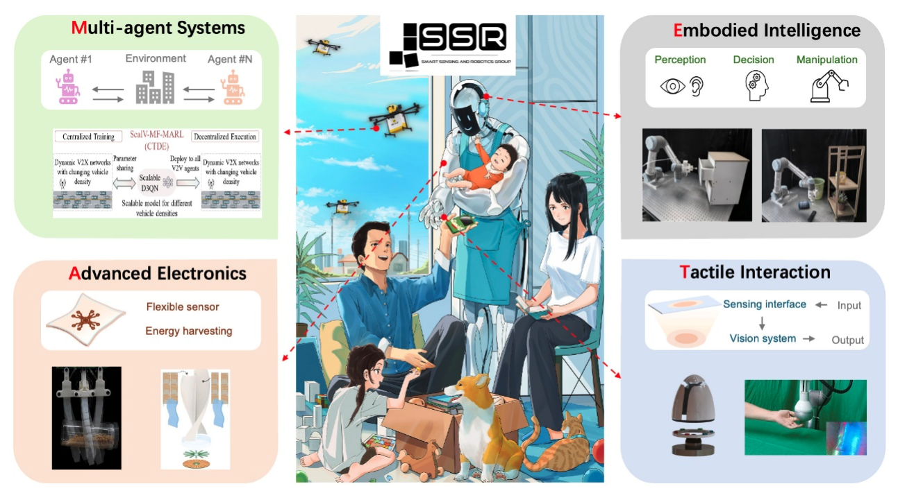

# 清华大学丁文伯团队招募实习生，硕士与博士生 | 欢迎加入顶尖科研团队

Smart Sensing and Robotics (SSR) Lab @THU——Embrace the last mile of human interaction.

## 团队简介
清华大学深圳国际研究生院丁文伯教授团队（Smart Sensing and Robotics Lab, SSR Lab）致力于机器人触觉感知、具身智能、计算机视觉及跨学科融合领域的创新研究。团队依托清华大学顶尖学术资源与深圳科技创新生态，聚焦“最后一公里”人机交互技术突破，推动学术前沿与产业应用的深度融合。
丁文伯，清华大学深圳国际研究生院副教授、博士生导师，发展规划办主任。国家青年特聘专家、国家重点研发计划青年项目首席科学家。分别于2011年和2016年在清华大学电子工程系获得学士和博士学位，2016年至2019年在美国佐治亚理工学院材料科学与工程系从事博士后研究。主要研究领域为机器人感知及智能人机交互系统，在Nature Communications、Science Advances、IEEE TRO、TMC、RAL等期刊发表论文80余篇，谷歌引用9000余次，H因子48。曾获2019年和2022年中国电子学会自然科学二等奖;IAS Residential Fellow;第47届日内瓦国际发明展金奖;2015年中国光学工程学会创新技术奖二等奖;2015年度lEEE Scott Helt Memorial Award(1/5);2015年清华大学特等奖学金等荣誉。担任信号处理期刊DSP副编辑、IEEE JSTSP机器人特刊首席客座编辑。

## 课题组主页
Webpage: https://ssr-group.net/

 

## 研究方向
机器人感知系统、智能材料与器件、机器学习算法、多模态人机界面、AI4S等，目标打破材料-器件-算法-系统的边界，构建下一代智能交互技术体系。

我们期待这样的你:
1. 专业背景：电子工程、机械工程、材料科学、计算机科学及相关领域，具备扎实的学科基础；
2. 技能优势：熟悉机器人系统开发、深度学习算法、传感器设计或硬件-软件协同开发经验者优先；
3. 科研热情：对人工智能、机器人感知与交互技术充满探索欲，乐于挑战跨学科难题；
4. 学历要求：欢迎本科、硕士、博士研究生及访问学生申请，亦开放博士后职位。

## 申请方式
申请材料：个人简历（含教育背景、研究经历、发表论文等）、代表性成果（可选）  
投递邮箱：ding.wenbo@sz.tsinghua.edu.cn 
邮件标题：【申请职位】+姓名+学校+专业（示例：【博士申请】张三+清华大学+电子工程） 
SSR Lab期待与志同道合的科研探索者并肩，在机器人技术与人工智能的星辰大海中，锚定属于你的学术坐标！ 

**注：团队长期开放合作，欢迎邮件咨询具体研究方向及招生计划！**
