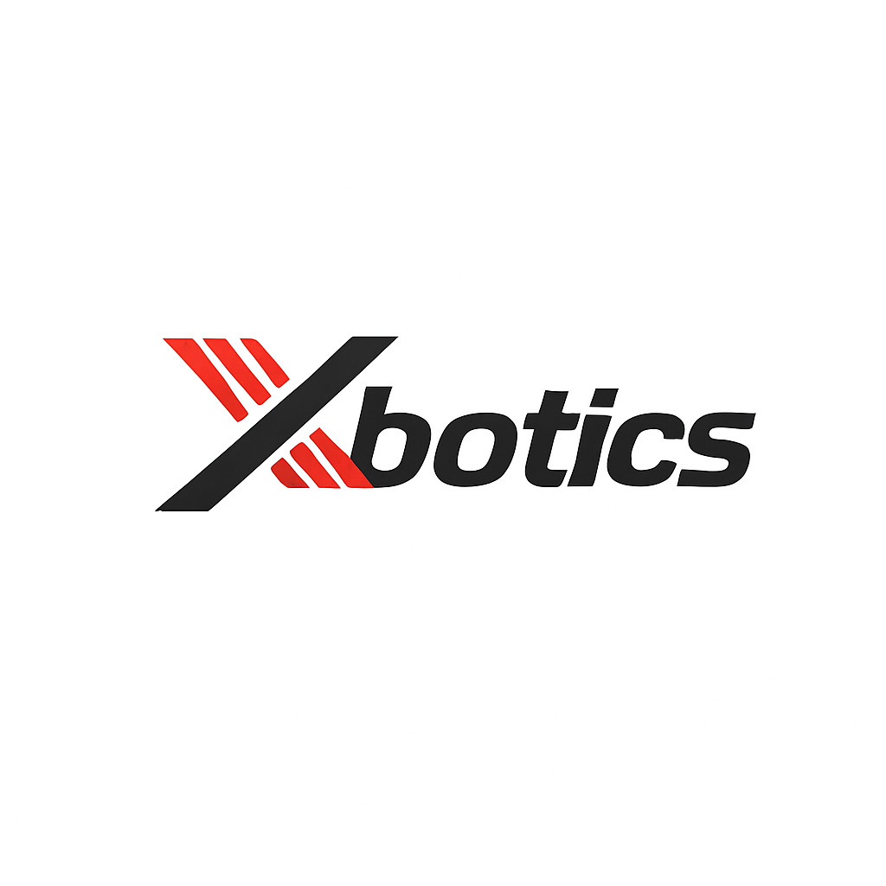

<h1 align="center">
Xbotics具身智能社区内推清单
</h1>

<strong>For applicants: </strong>

<strong>Don't panic! You are much better than you think!

If you don't feel well, feel free to reach us ヾ(^▽^*))

<strong>For employers: </strong>

Drop me a PR or issue, or contact me for posting your positions FOR FREE!

> 如果您是招聘者：这是一个完全公益和免费的项目，欢迎联系我们：Xbotics-木木(Xbotics具身智能社区创始人，微信 mmls20240701)。同时我们也提供完整的具身智能学习路线、学习课程、开源硬件购买。觉得有用就打个星吧

> 如果您是应聘者，且不确定自己适合哪份工作和职业发展困惑，可以联系林-具身聊一聊(微信mmls20240701)，需要我们内推的简历可以发送至内推邮箱：📮 xbot_hc@163.com。也欢迎关注我们的Xbotics具身智能社区！

📚 [Xbotics具身智能社区官方网站](https://xbotics-embodied.site/)

📚 [Xbotics具身智能社区知识库](https://mp.weixin.qq.com/s/zBuLAvh7ulbTNQe6jpzC5Q)

🔍 Know more about employers: [Ratemyprofessor](https://www.ratemyprofessors.com/), [Glassdoor](www.glassdoor.com), [导师推荐人](https://mysupervisor.org/), 导师评价网, 知乎/小红书

🌱 Paper readings, blogs: 
[Awesome-Robotics-Manipulation](https://github.com/BaiShuanghao/Awesome-Robotics-Manipulation)

[Awesome-Robot-Learning](https://github.com/RayYoh/Awesome-Robot-Learning)
 — 机器人学习（主要为操作 / Manipulation）资源合集。 

[Awesome-LLM-Robotics](https://github.com/GT-RIPL/Awesome-LLM-Robotics)
 — 大语言/多模态模型在机器人／RL中的论文、代码及相关网站。 

[Awesome-Robotics-Diffusion](https://github.com/showlab/Awesome-Robotics-Diffusion)
 — 针对扩散模型在机器人任务（操作/导航/规划）中的论文合集。 

[Awesome-Humanoid-Robot-Learning](https://github.com/YanjieZe/awesome-humanoid-robot-learning)
 — 汇总人形机器人学习方向的论文资源，优先含实机实验与开源代码。 

[Awesome-Robotics-3D](https://github.com/zubair-irshad/Awesome-Robotics-3D)
 — 专注于机器人领域中的 3D 视觉／理解／生成任务论文合集。 

[Awesome-Machine-Learning-for-Robotics](https://github.com/Phylliade/awesome-machine-learning-robotics)
 — 机器学习在机器人任务中的应用资源集合。 

[Awesome-Robot-Learning-Environments](https://github.com/jonzamora/awesome-robot-learning-envs)
 — 机器人学习中常用仿真环境清单（适合 RL/IL）。 

[Awesome-Robotics-Foundation-Models](https://github.com/robotics-survey/Awesome-Robotics-Foundation-Models)
 — 聚焦基础模型在机器人中的应用、挑战与未来研究方向。 

[Awesome-Robot-Visual-Imitation-Learning](https://github.com/ZhihaoAIRobotic/awesome-robot-visual-imitation-learning)
 — 聚焦视觉模仿学习／视频模仿机器人学习的论文/代码资源。 

[Awesome-Vision-Language-Action-Model](https://github.com/DelinQu/awesome-vision-language-action-model)
 — 针对视觉-语言-动作（VLA）模型的资源清单，侧重最新研究与数据集。

**只要您有机器人相关技能和经验，不限于以上岗位，都欢迎投递简历！**

## 1. Long-term Jobs | 长期招聘

[HKU MMlab 香港大学多媒体实验室](https://mmlab.hk/about-us#career)

[光轮智能 (Lightwheel AI)](./2025/lightwheel-ai.md)

[Tesla - Long term recruitment](https://www.tesla.com/careers)

[DIJ 大疆](https://we.dji.com/index_en.html)

[Boston Dynamics - Long term recruitment](https://bostondynamics.com/careers/#jobs)

 
 🚀👇 Click here to see more long-term job opennings | 点击展开更多长期招聘 👇🚀 
  

[星动纪元 - 社会招聘](https://k0fqxcszc9.jobs.feishu.cn/index)

[智元机器人 - 长期招聘链接](https://www.zhiyuan-robot.com/recruitment/166.html)

[智源研究院-社招/校招/实习](./2025/%E6%99%BA%E6%BA%90%E7%A0%94%E7%A9%B6%E9%99%A2-20250224.md)

[小米机器人 - 长期招聘链接](./2025/%E5%B0%8F%E7%B1%B3%E6%9C%BA%E5%99%A8%E4%BA%BA-%E5%AE%9E%E4%B9%A0%E7%94%9F-20250216.md)

[南大龙霄潇-PhD/Master/RA](https://zhuanlan.zhihu.com/p/30620630926)

[上海创智学院全球引进青年教师！](https://mp.weixin.qq.com/s/1w-6JicmTtlyAUeOHqS0Kw)

[舞肌科技 - 研发岗位招聘](./2025/%E8%88%9E%E8%82%8C%E7%A7%91%E6%8A%80.md)

[浙江人形机器人中心/校招/社招/实习，直接联系微信：i-zhongxiang,地点：宁波](https://mp.weixin.qq.com/s/ogQcUXd9IIioAUgpA7AmsA)

[清华大学SSR丁文伯团队 - PhD/MPhil/RA](./2025/THU-WenboDing.md)

[美的集团AI研究院 (上海/美国) - 具身智能](./2025/%E7%BE%8E%E7%9A%84%E9%9B%86%E5%9B%A2AI%E7%A0%94%E7%A9%B6%E9%99%A2.md)

[北京大学/宁波东方理工大学-PhD/RA](./2025/%E5%8C%97%E4%BA%AC%E5%A4%A7%E5%AD%A6or%E5%AE%81%E6%B3%A2%E4%B8%9C%E6%96%B9%E7%90%86%E5%B7%A5%E5%A4%A7%E5%AD%A6-PhDorRA-20250224.md)

[中大(深圳)张瑞茂组-PhD/RA/Ms/博后](https://zhuanlan.zhihu.com/p/13173488322)

[OpenDriveLab李弘扬组-校招/社招/实习/博后/RA](./2025/OpenDriveLab%E6%9D%8E%E5%BC%98%E6%89%AC%E7%BB%84-%E6%A0%A1%E6%8B%9Bor%E7%A4%BE%E6%8B%9Bor%E5%AE%9E%E4%B9%A0or%E5%8D%9A%E5%90%8EorRA-20250211.md)

[香港大学MMLab罗平组-PhD/RA](./2025/%E9%A6%99%E6%B8%AF%E5%A4%A7%E5%AD%A6MMLAB%E7%BD%97%E5%B9%B3%E7%BB%84-PhDorRA-20250211.md)

[清华叉院/千寻智能高阳组-PhD/RA](./2025/%E6%B8%85%E5%8D%8E%E5%8F%89%E9%99%A2or%E5%8D%83%E5%AF%BB%E6%99%BA%E8%83%BD%E9%AB%98%E9%98%B3%E7%BB%84-PhDorRA-20250211.md)

[上交MVIG_RHOS实验室李永露卢策吾组-PhD/MPhil/RA/Engineer](./2025/%E4%B8%8A%E4%BA%A4MVIG_RHOS%E5%AE%9E%E9%AA%8C%E5%AE%A4%E6%9D%8E%E6%B0%B8%E9%9C%B2%E5%8D%A2%E7%AD%96%E5%90%BE%E7%BB%84-PhDorMPhilorRAorEngineer-20250211.md)

[西湖大学机器智能实验室&西湖机器人王东林/张岳组-浙大联培PhD/RA/全职](./2025/%E8%A5%BF%E6%B9%96%E5%A4%A7%E5%AD%A6%E6%9C%BA%E5%99%A8%E6%99%BA%E8%83%BD%E5%AE%9E%E9%AA%8C%E5%AE%A4%26%E8%A5%BF%E6%B9%96%E6%9C%BA%E5%99%A8%E4%BA%BA%E7%8E%8B%E4%B8%9C%E6%9E%97or%E5%BC%A0%E5%B2%B3%E7%BB%84-%E6%B5%99%E5%A4%A7%E8%81%94%E5%9F%B9PhDorRAor%E5%85%A8%E8%81%8C.md)

[NTU Pine Lab (南洋理工感知与具身智能实验室) - PhD/PostDoc/RA/Master](https://pine-lab-ntu.github.io/joinus.html)

[Agility Robotics (US)](https://www.agilityrobotics.com/about/careers)

[北京大学董豪组 - 具身智能/智能机器人/计算机视觉 - 科研实习生\博士\硕士\博士后](https://zhuanlan.zhihu.com/p/568456535)

[DIJ大疆](https://we.dji.com/index_en.html)

## 2. Rolling Recruitment | 滚动招聘

**[2026.8.30]**
[跨维智能 - 具身智能算法工程师/AI视觉算法工程师/应用开发工程师/强化学习算法工程师等 - 27届校招](https://mp.weixin.qq.com/s/hZpiHtzDKCc5l5q7E5apaQ)

**[2026.8.29]**
[星海图 - 具身智能算法工程师/具身智能开发工程师|北京·海淀  机械结构工程师|深圳 - 27届校招](https://mp.weixin.qq.com/s/ncD7osQfbVKWJ1nTlsjVAg)

**[2026.8.27]**
[北京智源人工智能研究院 - Agent安全×具身智能安全、VLA/世界模型方向 - 实习](https://mp.weixin.qq.com/s/B93O09wm07u0PxLb9Xo3aA)

**[2026.8.25]**
[上海人工智能实验室 - 物理一致性视频生成模型研究 - 实习生](https://mp.weixin.qq.com/s/v5I_GNjnWaPX8EmJ_2gwEg)

**[2026.8.24]**
[箸境具身机器人 - 产品经理/VLA算法工程师/嵌入式软件工程师/嵌入式硬件工程师/强化学习算法工程师 - 27届校招](https://mp.weixin.qq.com/s/OQiclas-Yi0spF4LU-6QXQ)

**[2026.8.24]**
[华南理工大学 HAI 实验室的项目团队 - 机械结构工程师 - 广州 - 社招/全职](./2025/机械结构工程师)

**[2026.8.24]**
[普渡机器人 - 机器人仿真开发工程师/深度学习算法工程师/强化学习算法工程师/端到端模型算法工程师/世界模型算法工程师等 - 27届校招](https://mp.weixin.qq.com/s/cPRhnGxyqMXD1ZLbUftb5Q)

**[2026.8.23]**
[宇树科技股份有限公司 - 机器人数据运营工程师/具身智能软件工程师/数据管线工程师/具身数据评估工程师/解决方案工程师/海外销售专员/经理工业设计师/机器人测试工程师等 - 27届校招](https://mp.weixin.qq.com/s/G-hmtpY9-Ga2hgv7LE9mvQ)

**[2026.8.23]**
[极智嘉 - VLA算法工程师/世界模型算法工程师/强化学习算法工程师等 - 2027届校招](https://mp.weixin.qq.com/s/EJDADEE5P2c5H8fRWKQNzg)

**[2026.8.23]**
[中联重科 - 机器人和人工智能方向 - 27届校招](https://mp.weixin.qq.com/s/2qsvr8oRA2E-z5TTB52EKw)

**[2026.8.22]**
[地平线旗下地瓜机器人 - 人形Agent算法 - 实习生](https://mp.weixin.qq.com/s/XQOCewX-qlx5JtqYhfkA_g)

**[2026.8.19]**
[深蓝学院 - 器人开发/具身算法/运营/产品经理 - 全职/实习](https://mp.weixin.qq.com/s/LCepbqBGtnaxiiQZ5aTaXg)

**[2026.8.17]**
[九识智能 - 标定算法工程师/世界模型算法工程师/资深AI Infra工程师/仿真引擎专家/VLA算法工程师/自动驾驶三维重建专家/模型训练性能优化工程师/自动驾驶系统监控与优化工程师/端到端算法工程师（感知方向）/端到端算法工程师（PNC方向）/多传感器标定算法实习生等- 校招/社招/实习](https://mp.weixin.qq.com/s/aPIIx7AtiDxOVOi9bvpt0g)

**[2026.8.14]**
[博世智能驾驶与控制系统事业部（XC） - 数据算法工程师（3DGS 重建与仿真方向） - 上海/苏州 - 社招](https://mp.weixin.qq.com/s/RWS08im3wlSRC8oqHmRXyQ)

**[2026.8.13]**
[北京大学具身智能团队 - 世界模型+物理智能方向 - 实习生](https://mp.weixin.qq.com/s/3be2wx6FM_uburROXQKWqQ)

**[2026.8.13]**
[中联重科股份有限公司 - VLA大模型算法专家/强化学习算法专家/世界模型算法专家/机器人移动感知算法专家等 - 社招](https://mp.weixin.qq.com/s/pzMlc8sZWkMTYwM0AcGWng)

**[2026.8.12]**
[Sharpa - 具身智能算法岗 - 社招](https://mp.weixin.qq.com/s/BZEnwhirfSDtbVS9Guw1pQ)

**[2026.8.11]**
[千寻智能 - Al Infra 工程师/模型评测工程师/导航算法工程师/机器人软件工程师/后训练算法工程师/VLA操作算法工程师/机械开发工程师/数据算法工程师/Agent算法工程师/预训练算法工程师/具身运控算法工程师/电子电气测试工程师等 - 27应届校招](https://mp.weixin.qq.com/s/1D9yb--YEbK99eGLln1ZTw)

**[2026.8.10]**
[普渡机器人 - 算法/研发/产品/软件类 - 27应届校招/实习](https://mp.weixin.qq.com/s/rlwUK6sA5nIDh-IhI1K9ug)

**[2026.8.10]**
[地平线 - 算法/芯片/软件/硬件类方向 - 27应届校招](https://mp.weixin.qq.com/s/9Ku1vBD36bcDVENN-g8rOg)

**[2026.8.9]**
[小鹏集团机器人团队 - 具身运动控制算法专家(Locomotion)/具身算法部署工程师/具身智能灵巧操作算法工程师/专家/具身大模型Infra Engineer/Embodied AI System Engineer/具身数据Infra Engineer/具身智能模型推理架构师/VSLAM算法工程师-建图定位方向等 - 校招/实习/全职](https://mp.weixin.qq.com/s/zkIax2oVElGMwdSyNHyyfg)

**[2026.8.9]**
[中国信通院人工智能研究所 - 科研攻关方向：大模型、具身智能、智能体、安全可信、AI for Science、人工智能基础研究、应用研究、软硬件、数据要素、前沿探索等 - 27应届校招](https://mp.weixin.qq.com/s/Y_BT83NpBRR2k0zpRjmOSg)

**[2026.8.8]**
[Momenta - 世界模型算法工程师/端到端大模型算法/端到端决策规划等 - 全职/实习](https://mp.weixin.qq.com/s/8iPWQB_f2MbUNjlVcFJQOw)

**[2026.8.8]**
[银河通用机器人 - 具身多模态大模型/机器人规划与控制/机器人硬件与量产/具身智能操作算法/人形强化学习控制/具身软件系统开发](https://mp.weixin.qq.com/s/T1YOCXHpOCygOf0Q9ppm6w)

**[2026.8.7]**
[大晓机器人 - 具身智能算法研究员 - 实习生](https://mp.weixin.qq.com/s/LwjH7IjzOoPd89bI9ljzKQ)

**[2026.8.6]**
[阿里巴巴 - 算法/研发/芯片/产品类方向 - 27应届校招](https://mp.weixin.qq.com/s/zf61zNfpExEK7ItIc6H8tA)

**[2026.8.6]**
[深圳市龙岗区人工智能（机器人）署 - 产业研究岗2名、产业生态发展岗2名 - 社招](https://mp.weixin.qq.com/s/HH2mc9hdPNrCjgy4mBnbZQ)

**[2026.8.2]**
[小鹏集团机器人团队 - 具身运动控制算法专家(Locomotion)/具身智能灵巧操作算法工程师/专家/具身算法部署工程师/具身大模型 Infra Engineer/Embodied AI System Engineer/具身数据Infra Engineer/具身智能模型推理架构师/VSLAM算法工程师-建图定位方向/Omni模型算法工程师/研究员/多模态人机交互算法工程师/研究员/具身智能数据算法工程师等 - 社招/校招](https://mp.weixin.qq.com/s/CP_Zkb-V5OJkotDzCIcy0Q)

**[2026.8.2]**
[数聚变（武汉）科技有限公司 - 具身智能数据采集员/具身智能数据审核员/AI全栈开发工程师/ROS开发工程师 - 社招](https://mp.weixin.qq.com/s/J5wpNZBXqRlfWbTXE41SZQ)

**[2026.8.2]**
[珞石机器人 - 控制算法工程师、视觉算法工程师，软件工程师、机器人线束工程师、测试工程师、硬件工程师、嵌入式工程师、具身控制算法工程师、具身智能销售工程师、技术服务工程师等 - 校招](https://mp.weixin.qq.com/s/xPIOfJrwZCQbFRA08hCsZg)

**[2026.8.2]**
[银河通用 - 具身多模态大模型/机器人规划与控制/机器人硬件与量产/具身智能操作算法/人形强化学习控制/具身软件系统开发 - 27届校招](https://mp.weixin.qq.com/s/0n2CkLOF-f05ivpHSli5jg)

**[2026.8.1]**
[宇树科技 - AI算法工程师/语音大模型算法工程师/具身智能算法工程师/视觉大模型算法工程师/Alinfra工程师/具身数据评估工程师/运动控制算法工程师/数据管线工程师/SLAM算法工程师/嵌入式软件工程师 - 27届校招](https://mp.weixin.qq.com/s/d0U4SKIdOOASHcnWb9UYEg)

**[2026.8.1]**
[英伟达 - 机器人和智能驾驶类：具身智能、仿真、部署与人形机器人、智能驾驶系统 - 27届校招](https://mp.weixin.qq.com/s/C8UpYZBdaHoAnPP43CDw7w)

**[2026.8.1]**
[华威科 - 灵巧手高级结构工程师 - 社招](https://mp.weixin.qq.com/s/MmwxRd5nACNMh96aOKeGOQ)

**[2026.7.31]**
[热热数据 - 具身采集 - 社招](https://mp.weixin.qq.com/s/dN1jXl6z-L8v_K--AX2gLQ)

**[2026.7.31]**
[虹软科技 - 智能驾驶感知算法工程师/智能驾驶深度学习算法工程师/具身智能（机器人）大脑算法工程师等 - 27届校招](https://mp.weixin.qq.com/s/THDTY2wcGNECwuSAoYjoPg)

**[2026.7.31]**
[香港科技大学（广州）钟秉灼老师 - 具身智能安全/CPS控制和形式化方法方向 - 博士后/全奖博士生/研究助理](https://mp.weixin.qq.com/s/3LVri5HomdBA2-qVAZIBZA)

**[2026.7.30]**
[NVIDIA - 具身智能/仿真/部署等方向 - 社招/全职/实习](https://mp.weixin.qq.com/s/MlJPcf63BvFB1M3oPk-cnQ)

**[2026.7.29]**
[光轮智能 - 具身资深结构设计师 - 社招](https://mp.weixin.qq.com/s/ize-DKceJzbr2fffrIu3vw)

**[2026.7.28]**
[优必选 - 项目经理/数据合规高级经理（出海方向）/高级产品经理 - 社招](https://mp.weixin.qq.com/s/0T4578KsButWwDNeIUe3Ow)

**[2026.7.28]**
[中豫具身智能实验室 - 机器人/具身智能 - 博士研究生](https://mp.weixin.qq.com/s/212AE8IjogJ_mUPl8F4MUg)

**[2026.7.27]**
[浙江清华长三角研究院信息所 - 具身智能专家/大模型预训练专家/世界模型/ AI4S专家/产品总监 - 博士后](https://mp.weixin.qq.com/s/oDl2gOQcx0OQtPtAWzNtAA)

**[2026.7.24]**
[正行创新，姚颂 & 于超团队 - 具身智能算法专家/工程师(北京/新加坡)、强化学习专家/工程师(北京/新加坡)、导航规划算法工程师(北京/新加坡)、SLAM算法工程师(北京/新加坡)、基座模型研究员(北京/新加坡)、多模态感知算法工程师(北京/新加坡)、强化学习运动控制算法工程师(上海/新加坡)、机械臂运动控制专家/工程师(北京/新加坡)、遥操作算法专家(北京/新加坡)等 - 全职/实习](https://mp.weixin.qq.com/s/KUL2nVvOfbV-f3gAXJfaFg)

**[2026.7.24]**
[极智嘉具身智能团队 - 具身数据算法工程师/具身仿真算法工程师/机器人运动规划算法工程师/机器人运动控制与仿真工程师/世界模型算法工程师/VLA算法工程师等 - 社招](https://mp.weixin.qq.com/s/Qmz8gOQfYM3zydVgHWE_sw)

**[2026.7.23]**
[苏度科技 - 具身大脑岗位(上海)/具身本体岗位(上海)等 - 社招](https://mp.weixin.qq.com/s/a3Kyii6hvqW_OVO1-rIaTQ)

**[2026.7.23]**
[国科大AI学院&自动化所 - 灵巧操作技能学习/双臂移动操作/神经拟态视触觉感知等 - 实习](
https://zhuanlan.zhihu.com/p/2061817107336189303)

**[2026.7.20]**
[中煤科工机器人科技有限公司 - 具身智能算法工程师 - 社招](https://mp.weixin.qq.com/s/nVEaT5mQJoc7GIRtu6Zn-g)

**[2026.7.19]**
[西安交通大学 - 多模态感知与测量系统工程师/多机协同路径规划与调度系统工程师/具身智能与智能体研发工程师/硬件系统工程师 - 社招](https://mp.weixin.qq.com/s/__wF_QnTmhUS8gozxZyk-A)

**[2026.7.19]**
[卓驭科技 - 算法类/软件类/机电类等 - 27届校招](https://mp.weixin.qq.com/s/NC8uk8B2350qmhPi44K78A)

**[2026.7.18]**
[香港理工IEEE Fellow周立培教授团队 - 具身智能 - 博士生](https://mp.weixin.qq.com/s/9DqnW3kBLVBkpuULino-hw)

**[2026.7.18]**
[南京大手机器人有限公司 - 具身智能 - 实习生](https://mp.weixin.qq.com/s/uoC2ZT4KfOvK0uhiG5OkrA)

**[2026.7.17]**
[BrainCo - 具身智能算法 - 校招](https://mp.weixin.qq.com/s/jdEogRHz-8CZtOk3e9HX-A)

**[2026.7.17]**
[自变量机器人 - VLA算法工程师/世界模型算法工程师/灵巧手算法工程师/大模型Infra 工程师/强化学习算法工程师/运控算法工程师/嵌入式软件工程师/机械结构工程师 - 暑假实习生/27届校招](https://mp.weixin.qq.com/s/bTJ99gGQcIkIiUzNnNZcRw)

**[2026.7.16]**
[小米 - 具身智能&智能驾驶方向 - 校招/应届生/实现](https://mp.weixin.qq.com/s/1U1HR6PktE565aUS2Kx2CQ)

**[2026.7.15]**
[中煤科工机器人科技有限公司 - 具身智能算法工程师 - 社招](https://mp.weixin.qq.com/s/47szgWUuxoNJ2IAB6Ofmhw)

**[2026.7.15]**
[智元 - 研究类/算法类/软件类/硬件类等 - 2027届校招](https://mp.weixin.qq.com/s/Qkag6Tg4LXGLtEpQNPM77Q)

**[2026.7.14]**
[第四范式 - 具身智能开发 - 实习生](./2025/第四范式)

**[2026.7.13]**
[ 中科硅纪 - MCU嵌入式开发工程师/资深非标自动化机械工程师|机器人应用方向/机器人具身算法工程师/机械设计工程师 - 社招](https://mp.weixin.qq.com/s/V3bZZJsXd5BOo3vGgiHgPA)

**[2026.7.13]**
[自变量机器人 - VLA 算法工程师/世界模型算法工程师/灵巧手算法工程师/大模型Infra 工程师/强化学习算法工程师/运控算法工程师等 - 27届校招/暑假实习生](https://mp.weixin.qq.com/s/FddqYvT62b4eBKN_JlqiAA)

**[2026.7.12]**
[南京大学 - 具身智能/大模型方向 - 2027年申请考核制博士](https://mp.weixin.qq.com/s/IL3wzTgxXgnYUPcIw5xwvg)

**[2026.7.12]**
[中豫具身智能实验室 - 具身智能/机器人 - 博士研究生22名](https://mp.weixin.qq.com/s/oqz9cjGZAgvIo-_PUOoeag)

**[2026.7.10]**
[伽利略 - 运控/具身/导航算法岗 - 2027校招](https://mp.weixin.qq.com/s/iH_YSzSV2lLpCq3U9oO2ig)

**[2026.7.9]**
[德壹机器人郑州 - AI理疗机器人销售/AI机器人培训讲师 - 社招](https://mp.weixin.qq.com/s/AGaxWE-zyUYQj3Pvn6oHTQ)

**[2026.7.9]**
[浙江大学机器人研究院 - 具身智能大模型/机器人逻辑推理与协同策略规划/机器人感知算法/导航算法等 - 2026年度博士人才招聘](https://mp.weixin.qq.com/s/rkklk9fRWEMnQv-4qyJ4Sg)

**[2026.7.9]**
[中国科学院工业人工智能研究所 - 具身智能操作系统/大模型/智能算法等 - 博士后/研究员](https://mp.weixin.qq.com/s/43QrshZtTAsIjryalbgtOg)

**[2026.7.8]**
[南京大学计算机学院 - 具身智能工程师 - 社招](https://mp.weixin.qq.com/s/z0UezWgNG6QdClwaf6JM2g)

**[2026.7.2]**
[小米 - 具身智能/智能驾驶方向 - 应届生](https://mp.weixin.qq.com/s/Neu6PaucRl_YxdCz_GTAHw)

**[2026.7.1]**
[南京大学计算机学院 - 具身智能工程师 - 全职](https://mp.weixin.qq.com/s/rAgvRFuZYRw7s5u-g4bhmA)

**[2026.7.1]**
[昆山鑫泰利智能科技 - OpenClaw 部署⼯程师 - 全职](./2025/昆山鑫泰利智能科技)

**[2026.6.29]**
[北大董豪组 - 计算机视觉、机器人和具身智能方向 - 科研助理](https://mp.weixin.qq.com/s/q2OX2BoOFjxjnd1Yeoukeg)

**[2026.6.28]**
[启迪实验室 - 物理仿真下的手-物交互研究-科研助理（1名）/地机器人结构优化与抗扰控制研究-科研助理（1名）/连续体机器人控制与规划-科研助理（1名）/多智能体博弈算法设计-科研助理（1名）-实习](https://mp.weixin.qq.com/s/tKaalh38WQzEKYCL9XlWwg)

**[2026.6.26]**
[南京理工大学江苏省智能交通与车联网工程研究中心 - 科研助理岗（具身智能工程师）/科研助理岗(嵌入式工程师)/科研助理岗（大模型智能体工程师）/视觉工程师（计算机视觉算法方向）/项目经理 - 实习/全职](https://mp.weixin.qq.com/s/lISrdoGMQXPdYe2S8XooTA)

**[2026.6.26]**
[浙江人形机器人创新中心 - 交互测试开发/传统导航开发/数据采集等 - 27届校招/实习](https://mp.weixin.qq.com/s/a9QJWQCMhAC1ES3G9gTm6g)

**[2026.6.25]**
[博银合创 - VLA算法专家/SLAM算法工程师 /感知算法工程师/机械臂规控算法工程师 /强化学习工程师/软件工程师（C++/Python方向） - 社招](https://mp.weixin.qq.com/s/wsVPhIqwbfVO0GgBqjgNoQ)

**[2026.6.25]**
[八维通科技有限公司 - 具身智能VLA算法工程师 - 全职](./2025/八维通科技有限公司.jpg)

**[2026.6.25]**
[景联文科技 - 硬件产品负责人/硬件结构工程师/BSP驱动工程师/项目经理（具身智能）/项目经理（语音方向） - 社招](https://mp.weixin.qq.com/s/9ndw_OQ6NmJNhQx5vvcL4w)

**[2026.6.23]**
[湖北锋元具身机器人有限公司 - 电气工程师/工业机器人调试工程师 - 社招](https://mp.weixin.qq.com/s/0Qx9qx7TnIgpeeoqEcgpgQ)

**[2026.6.23]**
[千寻智能 - 具身智能算法岗/软件开发岗/硬件开发岗等 - 2027届校招](https://mp.weixin.qq.com/s/kjBOACP8fwTwJxIsX5Pzhw)

**[2026.6.20]**
[吉安核数集信息科技有限公司 - 数据采集（具身数据采集实习生） - 实习生](https://mp.weixin.qq.com/s/xrn2869WoIY_ZRSFshuC4A)

**[2026.6.19]**
[南京理工大学江苏省智能交通与车联网工程研究中心 - 科研助理岗（具身智能工程师）/科研助理岗(嵌入式工程师)/科研助理岗（大模型智能体工程师）/视觉工程师（计算机视觉算法方向） - 校招/社招](https://mp.weixin.qq.com/s/ait5sZq35qmbJGBHZM35Xw)

**[2026.6.19]**
[苏州灵猴机器人 - 机械结构、电气、嵌入式软件、硬件、SLAM算法等 - 社招](https://mp.weixin.qq.com/s/nS7-LwBgBu8Hn6kDZ1LKVg)

**[2026.6.18]**
[复旦大学脑智研究院赵梦迪课题组 - 计算神经科学与具身智能 - 博士后、实习生](https://mp.weixin.qq.com/s/ogyT5Z8K6RRWpl76aV9oWg)

**[2026.6.18]**
[清华证研院科创企业产融创新课题组 - 人工智能、具身智能方向 - 博士后](https://mp.weixin.qq.com/s/-CM0tA85CJ9lIDztsBHB2w)

**[2026.6.18]**
[腾讯Robotics X - 技术研究-机器人方向实习生、具身大模型评测与数据工程师(深圳)等 - 校招/社招](https://mp.weixin.qq.com/s/ZqdYhIoE8CL7yrjuP-yN_Q)

**[2026.6.18]**
[中国科学技术大学先进技术研究院具身机器人与智能系统工程技术中心 - 机械结构工程师/硬件工程师/嵌入式软件工程师/软件工程师 - 社招](https://mp.weixin.qq.com/s/n0_zro2C4_6FL0VeWInNkQ)

**[2026.6.17]**
[宇树科技 - AI算法工程师/具身智能算法工程师/语音大模型算法工程师/视觉大模型算法工程师等 - 27届校招](https://mp.weixin.qq.com/s/QmuBya2jwSsmQ95tXEaP2A)

**[2026.6.15]**
[数聚变（武汉）科技有限公司 - 具身智能数据采集员/具身智能数据审核员 - 社招](https://mp.weixin.qq.com/s/fvVteu4eK2aBBMfaq-nxLw)

**[2026.6.15]**
[卧安机器人 - 算法实习生(VLA、VLN、世界模型、数据)/规划导航控制算法实习生/数据标注实习生/AI产品实习生 - 实习](https://mp.weixin.qq.com/s/zamY1Q7avzpRAsCn6hb1lw)

**[2026.6.15]**
[中国科学院香港创新研究院人工智能与机器人创新中心（CAIR） - 多模态医学大模型/具身智能手术机器
人(控制/感知)工程师等 - 博士后/社招](https://mp.weixin.qq.com/s/I4-xNQXtIPwyN8y3DDcKoQ)

**[2026.6.14]**
[启元实验室自主系统中心具身智脑团队 - 机器人智能决策规划算法研究员/工程师、机器人具身智能体系统研究员/工程师等 - 校招、社招、实习生、博士后](https://mp.weixin.qq.com/s/PJZDmG1k3aH3C-R9sDKY5w)

**[2026.6.14]**
[小米集团 - MiClaw-大模型训练推理方向/NLP算法工程师/AI图像算法工程师/AI Agent开发/影像算法工程师/语音多模态算法工程师/运动健康算法工程师机器学习算法工程师 - 实习](https://mp.weixin.qq.com/s/prp54yjXwnou4vuILmzO3g)

**[2026.6.13]**
[北大工业具身智能实验室（PI-Lab） - 具身智能算法/PINN算法方向 - 实习生](https://mp.weixin.qq.com/s/07Ov3nQp53MbaDyUBe4yWg)

**[2026.6.11]**
[清华AIR AIoT团队 - 大模型部署与推理系统/智能体系统/多模态理解与生成大模型/科学智能与世界模型 - 研究助理(RA)/博士后/实习生](https://mp.weixin.qq.com/s/fHG7GlCcwcActqMYMTGpwA)

**[2026.6.11]**
[均胜集团 - 具身大模型推理优化专家/具身大模型算法专家（预训练方向）/具身大模型算法专家（后训练方向）/具身真机与仿真评测专家/灵巧手算法专家等 - 全职/博士后](https://mp.weixin.qq.com/s/R4Bt_0hFg4PWLn-q0nrLNw)

**[2026.6.11]**
[Sharpa Robotics  - 机器人算法工程师(Manipulation方向)/机器人算法工程师(遥操作方向)/机器人算法工程师(大模型方向)/机器人具身智能仿真工程师等 - 27届校招](https://mp.weixin.qq.com/s/9ATMCSt39EEN-zibG9aiDA)

**[2026.6.11]**
[数聚变（武汉）科技有限公司 - 具身智能数据采集员/具身智能数据审核员 - 社招](https://mp.weixin.qq.com/s/87s-TEGsknGh04dvUKMWgw)

**[2026.6.11]**
[西安电子科技大学广州研究院 - 实验室助理岗(1名) - 社招](https://mp.weixin.qq.com/s/9j3mwE5YniLEh36r3Z4_iQ)

**[2026.6.11]**
[自变量机器人 - 具身智能触觉算法工程师(触觉表征方向)/触觉力控Infra工程师/无本体数据算法工程师(Umi)等 - 社招/全职/实习](https://x2-robot.jobs.feishu.cn/index/position/list?keywords=&category=&location=&project=&functionCategory=&job_hot_flag=&tag=&store=&storeFrontListString=&type=&spread=8YA7P59&sessionid=)

**[2026.6.10]**
[北京大学工业具身智能实验室 - 力感知与接触式操作/动态物体抓取/生化实验室仿真与数据采集方向具身智能算法实习生、机器人与物理仿真方向/力学基础方向/核聚变等离子体智能控制方向PINN算法实习生 - 实习](https://mp.weixin.qq.com/s/lVni2p2P75jdDKscFxg1-w)

**[2026.6.10]**
[宇树科技 - AI算法工程师/具身智能算法工程师/语音大模型算法工程师/视觉大模型算法工程师等 - 27届校招](https://mp.weixin.qq.com/s/3oxP8Psodq9SQXEjb0HuLQ)

**[2026.6.10]**
[茂名市鸿数科技有限公司 - 数据采集 - 社招](https://mp.weixin.qq.com/s/eYQIONLs3CZ4uru4vFWCbg)

**[2026.6.10]**
[深圳理工大学人工智能研究院具身智能中心 - 高级工程师 - 社招](https://zhuanlan.zhihu.com/p/2047984422402658929)

**[2026.6.2]**
[宇树科技 - 大模型算法工程师/深度强化学习算法 - 全职](https://mp.weixin.qq.com/s/LkmXu2fY-WKu3xFxpWvSaA)

**[2026.6.1]**
[天津锐洁芯导机器人有限公司 - 机械工程师/装配工程师/数控操机 - 全职](https://mp.weixin.qq.com/s/NPoOD9ltKLrXGYWq8GcCGQ)

**[2026.6.1]**
[节卡机器人 - 机器人培训工程师/财务管培生/电气工程师 - 校招](https://mp.weixin.qq.com/s/cSbM-fPwSeAFGm-PTc79dQ)

**[2026.5.31]**
[上纬启元 - VLA模型研究员/强化学习研究员/世界模型研究员 - 实习生](https://mp.weixin.qq.com/s/qXtjgZxSoxmjkFGAmf08sQ)

**[2026.5.29]**
[源策未来 - 运控算法负责人/硬件数采负责人 - 实习](https://mp.weixin.qq.com/s/8ER-NPnc9b_iIZxCOOlZOA)

**[2026.5.27]**
[鹿明机器人 - VLA算法工程师/高级VLA工程师 - 全职](https://mp.weixin.qq.com/s/269Z2BVzlX0X158FJk8vBg)

**[2026.5.27]**
[立德机器人 -  机械工程师/硬件工程师/嵌入式软件工程师 - 全职](https://mp.weixin.qq.com/s/K-frrWtGi_OYHxU_51DmZQ)

**[2026.5.26]**
[浙江钱江机器人有限公司 - 运控算法工程师/3D视觉算法工程师/运控算法工程师/嵌入式软件工程师 - 全职](https://mp.weixin.qq.com/s/Mfv2whDmlU8SjcAlktv2AA)

**[2026.5.25]**
[埃夫特机器人 - 软件工程师/算法工程师/数控工艺师 - 全职](https://mp.weixin.qq.com/s/bF3U-ujymv13lf1iwHoFSg)

**[2026.5.24]**
[朗毅机器人 - SLAM算法工程师/导航算法工程师/AI视觉算法工程师 - 全职/实习](https://mp.weixin.qq.com/s/V04JcHBMDyWh-IssXposhQ)

**[2026.5.24]**
[普渡机器人 - 定位算法工程师/感知算法工程师/规划算法工程师 - 社招](https://mp.weixin.qq.com/s/2xBq4rbYDk8ego1BX--J6w)

**[2026.5.22]**
[卧安机器人 - VLA算法实习生/嵌入式开发实习生/软件测试实习生 - 实习](https://mp.weixin.qq.com/s/MgEhLItpdpvwA38Zy183xQ)

**[2026.5.22]**
[NVIDIA科技公司 - 机器学习工程师 - 全职](https://mp.weixin.qq.com/s/rLtIf2ApR6f3TLF6hQzIvA)

**[2026.5.19]**
[荣耀机器人 - 机器人强化学习算法工程师/机器人VLA和强化学习算法工程师 - 校招](https://mp.weixin.qq.com/s/K0n72lCayTTAVV3QxbGtFA)

**[2026.5.19]**
[银河通用机器人 - 具身算法生态工程师/嵌入式软件经理 - 全职](https://mp.weixin.qq.com/s/p-W5ZSxoVCvkpFZkk8xpOw)

**[2026.5.19]**
[奇瑞墨甲机器人 - 感知算法工程师/SLAM算法工程师 - 校招](https://mp.weixin.qq.com/s/bQzAtSy8qYTqAfiGtIKthw)

**[2026.5.16]**
[卧安机器人 - 嵌入式开发实习生/软件测试实习生 - 实习](https://mp.weixin.qq.com/s/txG3BIh816MxXILM-UfVBQ)

**[2026.5.16]**
[光轮智能 - 具身智能算法实习生/具身智能嵌入式开发实习生 - 实习](https://mp.weixin.qq.com/s/qfiPfXzSJjxszdZ-dm6xlw)

**[2026.5.13]**
[中移信息技术有限公司 - VLA预训练及模型架构方向具身智能算法/人形机器人运控算法/四足机器人运控算法 - 实习](https://mp.weixin.qq.com/s/oI0P-UFkVRl8V0dIL0HdhA)

**[2026.5.13]**
[破壳机器人 - 算法开发与实现/运控库集成 - 全职](https://mp.weixin.qq.com/s/GIVq3WTkX2CYJHeP-u7BaA)

**[2026.5.12]**
[鹿明机器人 - VLA算法/机械臂运控 - 全职](https://mp.weixin.qq.com/s/Urm7aEprfSx9x9oLMkYx-A)

**[2026.5.9]**
[杉川机器人 - 高级信息安全工程师 - 全职](https://mp.weixin.qq.com/s/G6yOFRKq7rLXR-P9Ro_R6Q)

**[2026.5.9]**
[朗毅机器人 - SLAM算法工程师/导航算法工程师 - 全职/实习](https://mp.weixin.qq.com/s/VsBKppm_d0_6NvFRYNiTuw)

**[2026.5.9]**
[ 卧安机器人 - VLA算法实习生/嵌入式开发实习生/软 - 件测试实习生 - 实习生](https://mp.weixin.qq.com/s/jY64H-6EyFvlcyJptVA-9Q)

**[2026.5.7]**
[星海图 - 强化学习算法工程师/具身智能算法工程师 /运控算法工程师 - 实习](https://mp.weixin.qq.com/s/bEg5WM2ho0RWMHoT_mXwFw)

**[2026.5.6]**
[破壳机器人 - 具身大模型算法工程师/运动控制算法工程师/slam算法工程师 - 全职](https://mp.weixin.qq.com/s/HWlaYY-amaVCBbweqs8Puw)

**[2026.5.5]**
[ 阿米奥机器人 - 机械结构工程师 - 全职](https://mp.weixin.qq.com/s/Ul4sJuGl1uOBdnCkvPtjHw)

**[2026.5.4]**
[金钢科技 - 工艺工程师/硬件开发/电磁设计工程师 - 社招](https://mp.weixin.qq.com/s/I4sqk5NSb1JMaBnO-tLp_w)

**[2026.5.3]**
[智元机器人 - 具身算法工程师/运动控制算法工程师/嵌入式软件工程师 - 全职](https://mp.weixin.qq.com/s/0GiegPcldk90FM0edhG-FQ)

**[2026.5.3]**
[睿尔曼智能科技 - 控制算法工程师/VLA模型训练/云端效能开发 - 社招](https://mp.weixin.qq.com/s/UTAklkkugXCV8U1sw68jpQ)

**[2026.5.3]**
[快仓机器人 - 图像算法工程师/点云算法工程师/运控算法工程师 - 校招](https://mp.weixin.qq.com/s/f2m1g46Yaf-KNDKKcGrDaA)

**[2026.5.2]**
[中天机器人有限公司 - 机器人项目销售经理 - 全职](https://mp.weixin.qq.com/s/HwAHYE44hqTu5lj1xKItAw)

**[2026.4.29]**
[宇树科技 - 具身智能软件工程师/数据管线工程师 - 全职](https://mp.weixin.qq.com/s/cHLQUQWmXyR_TpkfuEka_w)

**[2026.4.29]**
[卧安机器人 - VLA算法实习生/嵌入式开发实习生/软件测试实习生 - 校招/实习生](https://mp.weixin.qq.com/s/S6NK3lEDI61CmhCRqRlQOg)

**[2026.4.28]**
[海康机器人 - 技术支持工程师/技术支持工程师 - 校招](https://mp.weixin.qq.com/s/uwjpYf5cdAtndXrBNv2moA)

**[2026.4.23]**
[中国电信人工智能研究院（TeleAI） - 具身导航研究/水下SLAM算法/人形机器人嵌入式 - 实习生](https://mp.weixin.qq.com/s/SqgHK4ECAnrrwf7JbCLE0A)

**[2026.4.22]**
[中联重科股份有限公司 - 中联重科股份有限公司 - 全职](https://mp.weixin.qq.com/s/QgU0H69lsx3qvlKHVRlcnQ)

**[2026.4.21]**
[荣耀机器人 - 机器人决策规划算法工程师/人形机器人运动控制算法 - 全职](https://mp.weixin.qq.com/s/3AzCGOfWpXv091xtGHg8ig)

**[2026.4.18]**
[可信人工智能与自主系统实验室 - 端到端AI驾驶/四足机器人Al控制/无人机自主智能/跨平台具身Al框架 - 博士后](https://mp.weixin.qq.com/s/jxKslFJU11YyoKYJq73chw)

**[2026.4.17]**
[杭州云深处科技股份有限公司 - 导航算法工程师/端到端算法工程师/SLAM算法工程师 - 全职](https://mp.weixin.qq.com/s/_h2TkyPckFVxZMTZt1iy6A)

**[2026.4.16]**
[它石智航 - 机器人强化学习算法工程师/机器人感知算法工程师/机器人运动控制算法工程师/具身VLA算法工程师 - 校招](https://mp.weixin.qq.com/s/vd254vb_YxiKpHHZrWAKkg)

**[2026.4.15]**
[阿里通义实验室 - 人形具身控制模型研发/人形具身控制模型研发/大小脑协同探索 - 实习](https://mp.weixin.qq.com/s/JRWORhIZtX9VpdZWBErZqw)

**[2026.4.14]**
[清华系具身智能人形机器人公司 - 具身算法研究员/分布式训练工程师/推理加速与部署工程师 - 全职](https://mp.weixin.qq.com/s/NUcbD8FWd5FoVjtQ-3vGnA)

**[2026.4.13]**
[海康机器人 - 机器人强化学习算法工程师/机器人运动控制算法工程师/机器人决策规划算法工程师/机器人多维感知算法工程师 - 校招](https://mp.weixin.qq.com/s/Jw2QbTEnOLT8c83ZZw5qdw)

**[2026.4.12]**
[南方科技大学戴建生院士团队 - 智能结构与进化机器人/可重构制造与具身智能机器人 - 博士后](https://mp.weixin.qq.com/s/4CixmERZWkGlt8pqZnnkeg)

**[2026.4.12]**
[北京灵生科技有限公司 - 具身智能算法工程师 - 社招](https://mp.weixin.qq.com/s/wywa4iAob-8fUEehqFCCeA)

**[2026.4.12]**
[通义实验室 - 人形机器人全身运动控制大模型算法 - 实习生](https://zhuanlan.zhihu.com/p/2026012542141482942)

**[2026.4.12]**
[清华大学深圳国际研究生院AIoT - 陈鑫磊课题组 - 类脑感知/基于大模型的异构集群协同/具身智能等方向 - 实习生](https://zhuanlan.zhihu.com/p/2020473631524800406)

**[2026.4.12]**
[追觅科技 - SLAM算法工程师/规划算法工程师/多传感器融合感知算法工程师/三维重建算法工程师/强化学习算法工程师 - 校招/社招](https://mp.weixin.qq.com/s/uRIIhOcmgVHw6DjanS467Q)

**[2026.4.11]**
[上纬启元 - VLA模型研究员/强化学习研究员/具身数据研究员 - 实习生](https://mp.weixin.qq.com/s/8Zxxzj9nLJCXzc5xnL7Sdg)

**[2026.4.10]**
[优必选科技 - 遥操算法工程师/运控算法工程师 - 全职](https://mp.weixin.qq.com/s/YyyWnwx5cAcqkj4bjx0mRA)

**[2026.4.9]**
[卡尔动力 - 自动驾驶感知算法实习生/预测算法工程师（端到端） - 实习](https://mp.weixin.qq.com/s/TW2BHLiN5099wkzesbaRBg)

**[2026.4.8]**
[千寻智能 - 具身智能算法工程师/AI Infra - 实习](https://mp.weixin.qq.com/s/wU5ZNwKGsfCuUzkeQmt7rw)

**[2026.4.7]**
[众擎机器人科技有限公司 - SLAM算法工程师/自主导航算法工程师 - 全职](https://mp.weixin.qq.com/s/JkbWOZCpxg--U8sSfcaApA)

**[2026.4.6]**
[中三兵器装备集刁自动化研究所有限公司 - 硬件设计工程师/电气系统工程师/机器人结构设计 - 全职](https://mp.weixin.qq.com/s/K-kLck70XAZrtBX77T4lcw)

**[2026.4.5]**
[小米集团 - 具身智能算法研究员/语音大模型算法研究员/端到端算法研究员 - 校招](https://mp.weixin.qq.com/s/2DybXBcmszZ7YL2JIpJrlw)

**[2026.4.4]**
[字节跳动Seed大模型 - 基础大模型/视觉智能/机器学习系统 - 校招](https://mp.weixin.qq.com/s/MNzL9O0gb_1xRO7LEhRvgQ)

**[2026.4.3]**
[思谋科技 - 算法工程师/硬件工程师/产品经理 - 校招/实习](https://mp.weixin.qq.com/s/SE3ILE_nma3pN8o5qTEqSw)

**[2026.4.2]**
[奇瑞智能化研究院 - 仿真开发助理工程师/运动控制算法助理工程师/具身智能算法助理工程师/仿真开发助理工程师/动力学助理工程师/底盘硬件助理工程师等 - 2026校招](https://mp.weixin.qq.com/s/KLpyehLO3Zhn69ym3fKBqA?scene=1&click_id=49)

**[2026.4.2]**
[智元机器人 - 具身感知算法工程师/具身感知算法实习生/交互世界模型实习生等 - 实习](https://mp.weixin.qq.com/s/4z7Mocob412GALlUdRHvwA?scene=1&click_id=51)

**[2026.4.2]**
[低空具身智能机器人中心 - 低空具身智能首席科学家（1人） - 社招](https://mp.weixin.qq.com/s/Xk78tkwdeUbGTBZA5mDm8Q?scene=1&click_id=36)

**[2026.4.1]**
[美的研究院 - 具身智能专家/机器人全栈工程师具身智能算法(强化学习)/具身智能-仿真工程师运动控制算法/具身智能数据采集工程师/多模态空间智能算法等 - 社招](https://mp.weixin.qq.com/s/7Qj-jYdRP44KpiRb-uepvg?scene=1&click_id=48)

**[2026.4.1]**
[南方科技大学戴建生院士团队 - 机构学与机构理论/智能结构与进化机器人/可重构制造与具身智能机器人方向 - 博士后](https://mp.weixin.qq.com/s/djyyv6eIrVGbLGubsSgGww?scene=1&click_id=44)

**[2026.4.1]**
[北京航空航天大学机械工程及自动化学院具身智能机器人研究院 - 研发工程师、F岗 - 社招](https://mp.weixin.qq.com/s/yEGfuTGVh5ghadYpxxsnCw?scene=1&click_id=42)

**[2026.3.31]**
[诺亦腾机器人 - 数据、模型算法研究员/模型算法工程师/模型算法实习生/触觉算法实习生/数据处理算法实习生/定位算法工程师/Android 移动端开发工程师（数据采集方向）/数据采集应用开发工程师/具身智能多模态系统测试工程师/定位算法实习生等 - 校招/社招/实习生](https://mp.weixin.qq.com/s/Z805VuYiz6kVcFAU-HSoTA?scene=1&click_id=41)

**[2026.3.28]**
[海康机器人 - ROS软件开发工程师/结构设计工程师 - 社招](https://mp.weixin.qq.com/s/6-2Fhba1V-z6MIC1TPH68Q)

**[2026.3.27]**
[北京松延动力科技有限公司 - 人形机器人运控算法/RL强化学习运控算法 - 实习/社招](https://mp.weixin.qq.com/s/9BjOzW1F52jz2q3BOwitqA)

**[2026.3.26]**
[智身科技 - VLA算法工程师/大模型算法工程师 - 社招](https://mp.weixin.qq.com/s/OdKXIkZXNJbz0Ms85w7aTQ)

**[2026.3.25]**
[木兰机器人 - 沃尔玛运营 - 全职](https://mp.weixin.qq.com/s/42hahFs1WG2mqX1btsi4qw)

**[2026.3.25]**
[国巡机器人 - 嵌入式软件工程师/高级工艺工程师 - 社招](https://mp.weixin.qq.com/s/ZHtB97VHtFrv9X0oeR5h_Q)

**[2026,3.24]**
[光轮智能 - 具身智能算法工程师 - 实习/全职](https://mp.weixin.qq.com/s/6-AUavPl1hnKEcK9nsW6Kw)

**[2026.3.23]**
[地瓜机器人 - Lidar SLAM算法工程师/视觉感知算法工程师 - 社招](https://mp.weixin.qq.com/s/MiLR0TyAu8ZGcmIlXfQPOQ)

**[2026.3.22]**
[宇树科技股份有限公司 - 机器人运动控制算法工程师/深度强化学习算法工程师 - 社招](https://mp.weixin.qq.com/s/e_kN9rO3uEThn38x1CwpQg)

**[2026.3.21]**
[中科院香港创新研究院 - 机械臂控制工程师（医疗与具身机器人方向） - 全职](https://mp.weixin.qq.com/s/eRXlCiL5E29jfYe6aMPrfg)

**[2026.3.20]**
[朗毅机器人 - SLAM算法工程师/导航算法工程师等 - 全职/实习](https://mp.weixin.qq.com/s/5hsyNI-d6zK9PwOVCp59uQ)

**[2026.3.19]**
[蚂蚁天玑实验室 - 具身智能研究型算法 - 实习](https://mp.weixin.qq.com/s/1RndRCJioGKlbnRzMv6q9w?scene=1&click_id=1)

**[2026.3.18]**
[阿里达摩院具身智能 - 大模型研发工程师/世界模型算法专家 - 社招](https://mp.weixin.qq.com/s/OvJnBTyATAwvKudaz7DxTg?scene=1)

**[2026.3.18]**
[清华大学 NLP 实验室 - 视觉-语言-动作模型（VLA） - 校招](https://mp.weixin.qq.com/s/h6X_lZ0GU0L382BYwFe_6Q?scene=1&click_id=3)

**[2026.3.17]**
[EIR四川具身人形机器人科技有限公司 - 运动控制算法工程师/高级结构工程师等 - 全职](https://mp.weixin.qq.com/s/6dRpEag8yW3jkZqudjarWA?scene=1&click_id=2)

**[2026.3.16]**
[EmbodyX 具身智能 -  机器人 AI 工程师 - 实习生](https://mp.weixin.qq.com/s/_AmGwRrALjAUxZY-M4jnXw?scene=1&click_id=1)

**[2026.3.15]**
[宇树科技 - 技术支持工程师 - 校招](https://mp.weixin.qq.com/s/PnC5q81fANHnRJIfETo-Vg)

**[2026.3,14]**
[松灵机器人 - 具身智能算法工程师/ROS开发工程师 - 校招/实习生](https://mp.weixin.qq.com/s/LA9vR-OGN4ggzRlfNw10rA_)

**[2026.3.13]**
[优理奇机器人 - 机械臂结构设计工程师 - 实习生](https://mp.weixin.qq.com/s/nSvsC3YCvTT-lxVtB8oNGQ)

**[2026.3.13]**
[卓驭科技 - 移动物理AI方向专家/物理AI大模型算法 - 社招/校招](https://mp.weixin.qq.com/s/JBPfCvRAwdx1z0wkZZjSiA)

**[2026.3.12]**
[高工人形机器人 - 人形机器人产业编辑/人形机器人视频编导 - 社招](https://mp.weixin.qq.com/s/HB_j5uHcdlH22_fAyDmTIQ)

**[2026.3.9]**
[智元机器人 - VLA 数据算法 - 实习生 - Base：上海](https://zhuanlan.zhihu.com/p/2014284623459393759)

**[2026.3.9]**
[智元机器人 具身操作团队 - 具身大模型算法工程师/多模态运控算法工程师/ VLN视觉语言导航算法工程师 - 全职](
https://zhuanlan.zhihu.com/p/2013336472036593745)

**[2026.3.9]**
[钛虎机器人 - 算法工程师/应用工程师等 - 校招](https://mp.weixin.qq.com/s/5o32e0II0Qgow56_da4aiw)

**[2026.3.8]**
[NIO蔚来 - 数字艺术类 - 校招](https://mp.weixin.qq.com/s/oZFOCkGkNk1-9kQxRu3hfg)

**[2026.3.7]**
[自变量机器人 - 世界模型算法工程师 - 社招](https://mp.weixin.qq.com/s/YqOdJEE2hON9QQrecmWSGA)

**[2026.3.6]**
[智元机器人 - 机器人系统集成工程师/机器人算法工程师(C++方向)/机器人决策算法工程师等 - 全职](https://mp.weixin.qq.com/s/OlN6DhMmTYaW9lRH-MAa-w)

**[2026.3.5]**
[杭州宇树科技股份有限公司 - AI算法工程师(具身智能/AGI)/运动控制算法工程师 - 校招/社招](https://mp.weixin.qq.com/s/QKJq5TfMW5Neut8UrWyuGA)

**[2026.3.5]**
[深蓝学院 - 人形机器人Loco-Manipulation研发 - 实习生](https://mp.weixin.qq.com/s/olNnazjFfafDhvfs7mvp0g)

**[2026.3.4]**
[上海人工智能实验室 - 科学具身智能&Agent方向(本科可投) - 全职](https://mp.weixin.qq.com/s/TmQh9kPVEbhD7ClAnEMgzw)

**[2026.3.3]**
[广东具身风暴机器人有限公司 - 机器人算法工程师（控制+视觉/AI） - 全职](https://mp.weixin.qq.com/s/7jW2p58WkMKiQKUEEL_sWg?scene=1)

**[2026.3.2]**
[具身智能 × 教育创新，学术合作实习生正式招募 - 灵心巧手学术合作 - 全职](https://mp.weixin.qq.com/s/XjUWy8gmWw0vq9tEftKRlg?scene=1&click_id=12)

**[2026.3.1]**
[北京睿尔曼智能科技有限公司 - 机器人系统测试 - 2026届校招](https://mp.weixin.qq.com/s/7giEW2eczLmAqJIgR5BBAA?scene=1)

**[2026.2.28]**
[自动驾驶独角兽Momenta招募 - 端到端规划算法方向 - 实习生](https://mp.weixin.qq.com/s/u4TuYO9Nqm61_6tVGtyg2Q)

**[2026.2.26]**
[深圳市越疆科技股份有限公司 - 机器人算法研究员/机器人算法工程师(运动规划方向)/嵌入式软件工程师(C++方向)/嵌入式软件工程师(MCU方向)等 - 2026届校招](https://mp.weixin.qq.com/s/naMnqFAeK2JG7Bdjm_xXqg)

**[2026.2.12]**
[松延动力（北京）科技有限公司 - 强化学习运控算法工程师/机器人运控算法工程师/高级强化学习算法工程师/RL长期实习生 - 实习/全职](https://mp.weixin.qq.com/s/OMikdQrYNg3X-Uu66vkjaw?scene=1&click_id=4)

**[2026.2.11]**
[亿嘉和 - 大模型背景人形机器人语音对话 - base南京 - 硕博](https://www.yijiahe.com/)

**[2026.2.9]**
[北京银河通用机器人股份有限公司 - 机器人遥操算法工程师/机器人应用开发工程师（具身智能 & 情感交互方向） - 社招](https://mp.weixin.qq.com/s/aC3LUlH52y4PbCjeCWDGDA)

**[2026.2.8]**
[深圳福田实验室 - 大量机器人具身领域岗位 - 社招](https://mp.weixin.qq.com/s/0MKoU3hYcHCSfkJosSk0Sw?scene=1&click_id=32)

**[2026.2.8]**
[西湖大学TGAI实验室 - 具身智能硬件工程师 - 科研助理1人 - 杭州](https://mp.weixin.qq.com/s/Xuw6F1fk6BCVOripLXQKPQ?scene=1&click_id=31)

**[2026.2.7]**
[字节跳动 - 算法/机器学习/计算机视觉等研发岗 - 校招](https://mp.weixin.qq.com/s/vRu9eyBMYoaqRaVu4A0SEA)

**[2026.2.6]**
[港科大谭平组 - 人形机器人 - 科研助理/硕博](https://mp.weixin.qq.com/s/IgdDbigndr_2kiaG291k3A)

**[2026.2.4]**
[柏奥尼克机器人 - 强化学习算法工程师/VLA算法工程师/传统运动控制算法工程/机械臂运控算法工程师/电机电控算法工程师 - 社招](https://mp.weixin.qq.com/s/gcBn6wzWlzQvomKjK1dOYQ)

**[2026.2.3]**
[惠阳异构具身智能训练场项目 - 具身智能数据采集员 - 社招/实习](https://mp.weixin.qq.com/s/Ca6PcpShadEfJK7jeVZrNA?scene=1&click_id=11)

**[2026.2.2]**
[蚂蚁灵波科技 - VLA模型算法工程师-具身智能方向/VLA模型算法实习生 - 社招/实习](https://mp.weixin.qq.com/s/xDC-u4cDFGNPBTJnlSZCmA)

**[2026.2.1]**
[深圳理工大学-计算机科学与人工智能学院-具身智能实验室 - 具身算法研究实习生（若干）](./2025/具身算法)

**[2026.2.1]**
[美团 LongCat基座大模型团队 - 具身智能实习生 - 可转正/校招](https://mp.weixin.qq.com/s/ijFNxQlCUz9iECujwWZ9ZQ)

**[2026.1.31]**
[南京大学三维视觉实验室龙霄潇课题组 - 三维视觉、图形学、具身智能等方向 - 硕博、联培、访问生](https://mp.weixin.qq.com/s/cnvg1LswhE8ZEoXxohPqIQ)

**[2026.1.29]**
[大疆 - 视觉/决策规划算法工程师（深圳/上海/北京）- 全职](https://mp.weixin.qq.com/s/PDSfLXGhiC3Mrfx1nCTCuA?scene=1&click_id=2)

**[2026.1.27]**
[理想汽车 - 入式软件工程师-灵巧手/算法研发工程师-全身运控/嵌入式硬件工程师-交互感知 - 全职](https://mp.weixin.qq.com/s/vHTNZpHXIOrJqIR1qDZq3w)

**[2026.1.26]**
[大疆无人机感知团队 - 感知算法方向工程师 - 全职](https://mp.weixin.qq.com/s/MniNaRFqe3qDwsr3gDKTog)

**[2026.1.25]**
[浙大-具身智能与强化学习课题组 - 具身智能决策与控制/视觉-强化学习方向 - 科研实习生](https://mp.weixin.qq.com/s/itkrbLKmH1J1aZc5fDngaw)

**[2026.1.25]**
[香港科技大学（广州）具身智能研究所 - 硬件/软件工程师、科研助理 - 全职/实习](https://mp.weixin.qq.com/s/-jDFhiogkHma3dhlb8aFsQ?scene=1&click_id=5)

**[2026.1.23]**
[智元机器人具身研究中心罗剑岚博士团队 - 大模型预训练研究员/世界模型研究员/灵巧手控制算法工程师/大规模分布式训练研究员等 - 社招](https://mp.weixin.qq.com/s/bWMn5FXM3LyWjhdrPOMUSw?scene=1&click_id=4)

**[2026.1.22]**
[自变量机器人 - 机械臂开发工程师 - 全职](https://mp.weixin.qq.com/s/KS3-bdWvpW61V-VJe7MHNQ?scene=1&click_id=3)

**[2026.1.22]**
[中国空间技术研究院CAST+AI·R人工智能专班 - 大模型算法研发/大模型数据治理/大模型应用系统开发/具身智能算法研发 - 全职/实习](https://mp.weixin.qq.com/s/c4fAcV0U_J0zBxbS0VXEKA)

**[2026.1.22]**
[奇瑞汽车 智能化研究院 - 具身智能算法/具身智能产品开发/具身智能仿真开发等 - 芜湖/上海 - 全职](https://mp.weixin.qq.com/s/aVUfj082lSMqqY3CK6ZdjQ)

**[2026.1.20]**
[复旦大学嵌入式深度学习实验室 - 具身智能方向 - 博士后](https://mp.weixin.qq.com/s/gD9uBJd6bZHnba61ijWqQg)

**[2026.1.17]**
[广东福田实验室 - 具身智能大模型算法工程师/控制算法工程师/控制算法工程师(关节控制)/算法实习生等 - 全职/实习](https://mp.weixin.qq.com/s/tPSGK5fUWrXEFpetpuo4-g)

**[2026.1.17]**
[计算机视觉方向深度学习算法实习生-base杭州 - 实习](./2025/计算机视觉)

**[2026.1.16]**
[北京智源人工智能研究院（BAAI）具身智能团队 - UMI & VLA - 实习](https://mp.weixin.qq.com/s/tm-s4CME_X7684-rkcg3uA?scene=1&click_id=3)

**[2026.1.15]**
[启元实验室-湖南大学联培PhD项目 - 具身智能方向 - 社招](https://mp.weixin.qq.com/s/PpNXo4B45T82tySF4m4Ssg)

**[2026.1.13]**
[南方科技大学戴建生院士团队 - 机构学与机构理论/智能结构与进化机器人/可重构制造与具身智能机器人方向 - 博士后](https://mp.weixin.qq.com/s/BzFYRbIMqr7ZFllr2nKzLw?scene=1&click_id=9)

**[2026.1.12]**
[韩国科学技术院黄荷叶博士 - 自动驾驶/具身智能方向 - 全奖博士研究生和科研助理（26年秋季入学）](https://mp.weixin.qq.com/s/O8kx-PUUwUUkRz4e9-7ctw?scene=1&click_id=8)

**[2026.1.11]**
[雄安中晟泰合科技有限公司 - 机械结构设计实习生/算法工程师助理/产品经理助理/项目经理助理/商务经理助理 - 实习生](https://mp.weixin.qq.com/s/G8sm0TNCdJQyleZPMaEvLg?scene=1&click_id=9)

**[2026.1.11]**
[英达视 - 软件算法实习生(具身智能方向)/具身大模型算法 - 实习生](https://mp.weixin.qq.com/s/K5MbnS7NqvBQf7yBh-5M7w?scene=1&click_id=6)

**[2026.1.8]**
[智瀚星途 - 产品经理（杭州）/定位算法实习生（武汉）/VLM算法实习生（武汉）/VLA大模型算法实习生（武汉）/仿真算法实习生（武汉）/机械臂VLA 算法实习/全职（武汉） - 全职/实习](https://mp.weixin.qq.com/s/qb-tejzfLA7pCUevTZ6eWw?scene=1&click_id=16)

**[2026.1.7]**
[北京市机器人产业协会 - 专职副秘书长/业务拓展事业部负责人/产业研究事业部负责人/标准事业部负责人 - 社招](https://mp.weixin.qq.com/s/mX3sASzmMaXNXuP1UcgeJQ?scene=1&click_id=20)

**[2026.1.7]**
[特马工业技术（上海）有限公司 - 工业机器人调试工程师 - 社招](https://mp.weixin.qq.com/s/3qtEiO-dB7VEm_yEbouOmw?scene=1&click_id=19)

**[2026.1.7]**
[深圳技术大学灵巧机器人学课题组 - 机器人灵巧操作/多模态等方向 - 专职副研究员/博士后](https://mp.weixin.qq.com/s/nwTmiZPDWA1VP2PxaAfWqg?scene=1&click_id=18)

**[2026.1.6]**
[NVIDIA - 高级软件工程师密集重建(上海/北京/广州)/工程经理人形机器人移动操作(上海) - 社招](https://mp.weixin.qq.com/s/6Z7H1NobP2eUwn0vNvlI3w?scene=1&click_id=6)

**[2026.1.5]**
[香港科技大学（广州）具身智能研究所 - 行政方向](https://mp.weixin.qq.com/s/Oz_qbKQF1vJ4oiHjmMsPAQ)

**[2026.1.5]**
[具身刺绣 × 青少年女性心身健康研究项目 - 多模态交互技术实习生/体验与视觉设计实习生 - 实习](https://mp.weixin.qq.com/s/0kEXKIbFwYZO9P-JvB399Q?scene=1&click_id=14)

**[2026.1.5]**
[小米机器人 - 具身智能算法 - 实习生](https://mp.weixin.qq.com/s/G0jI5w3_mv4Zzn9eQbdGnw?scene=1&click_id=13)

**[2026.1.4]**
[中联重科股份有限公司 - 机器人研发工程师/具身大模型专家/机器人控制算法专家/机器人感知算法专家/机器人多模态算法工程师等 - 校招/社招](https://mp.weixin.qq.com/s/ukOxOA23-yM0md91m55xyA?scene=1&click_id=11)

**[2026.1.3]**
[北京字节跳动科技有限公司 火山引擎 - 操作算法资深专家（具身智能）/具身导航算法专家 - 全职](https://mp.weixin.qq.com/s/92odWhqbiqdNEp7Rd3TkJg?scene=1&click_id=10)

**[2025.12.31]**
[中国科学院软件研究所 - 自动驾驶/智能交通/具身智能/世界模型方向 - 实习（支持远程）](https://mp.weixin.qq.com/s/wKCukOLG0zloC-ktPodDsw)

**[2025.12.30]**
[清华系具身智能数据团队·星忆智能 - 具身智能 - 实习](https://mp.weixin.qq.com/s/6YKY5yywgZDWwMjVOYKymA?scene=1&click_id=11)

**[2025.12.30]**
[南京我乐家居股份有限公司 - AI具身智能算法工程师 - 南京 - 社招](https://mp.weixin.qq.com/s/eHxItEXymvHDnt2kD5QAVw?scene=1&click_id=10)

**[2025.12.30]**
[长虹智能机器人公司 - 机器人系统架构工程师/机器人算法工程师（VLA/RL）/机器人VLN算法工程师](https://mp.weixin.qq.com/s/IclhGyIjBeMdfMcd0Y8Z9Q?scene=1&click_id=9)

**[2025.12.30]**
[北京银河通用机器人股份有限公司 - 机器人规划算法实习生/具身算法应用工程师(26届)/3D人体算法研究员 - 校招/社招/实习](https://mp.weixin.qq.com/s/aKbbdbYHa8VpvXMAkGnxDA?scene=1&click_id=4)

**[2025.12.29]**
[造父Robotaxi云端算法团队 - 世界模型-重建算法工程师/专家/、世界模型-生成算法工程师/专家、云端基础模型算法工程师/专家、云端标注算法工程师/专家、云端仿真算法工程师/专家等 - 全职/实习](https://mp.weixin.qq.com/s/B5cXs6LgUFaNJzKPZ2swsQ?scene=1&click_id=3)

**[2025.12.28]**
[小鹏机器人 - LLM/VLM算法 - 研发实习生](https://mp.weixin.qq.com/s/J7w18o67B1W_5aYtcOvtWA)

**[2025.12.27]**
[清华大学电子工程系SenseLab实验室 - 具身智能机器人集群协同探索算法与模型方向 - 实习/科研](https://mp.weixin.qq.com/s/YJuFpSu256Ryimx_kgD74Q)

**[2025.12.27]**
[xLean颗粒进化 - 嵌入式软件开发工程师（蓝牙通信方向）/SLAM算法工程师感知 / 图像算法工程师/导航算法工程师（可接受C++开发转岗）/硬件产品经理硬件工程师/SQE工程师（机电模组、电子料方向）/AIoT全栈开发工程师/嵌入式 Linux 系统开发工程师 - 实习/全职](https://mp.weixin.qq.com/s/xSWufmYqSI7wbV7e_-XzUA)

**[2025.12.26]**
[上海青心意创科技有限公司 - 具身智能算法工程师/机器人软件研发工程师/足式运动控制工程师（RL） - 社招](https://mp.weixin.qq.com/s/4TyA2wRo5CFsZcSCRsGFuw)

**[2025.12.25]**
[中国科学院空间应用工程与技术中心 - 空间具身智能操控技术研究岗位1名 - 社招](https://mp.weixin.qq.com/s/Q5ODTLuguMO50Cu0cysXVw?scene=1&click_id=3)

**[2025.12.25]**
[北京白海豚海豚科技有限公司 - 机器人数据采集员 - 社招](https://mp.weixin.qq.com/s/nKaP_rhKCN7epyTCpkVSQQ?scene=1&click_id=2)

**[2025.12.25]**
[吉利研究院 - 足式机器人运动控制算法开发工程师 - 社招/实习](https://mp.weixin.qq.com/s/_VuXs_OQ5nrEV8oX8S3rXQ?scene=1&click_id=14)

**[2025.12.24]**
[上海禾赛科技有限公司 - 高性能计算工程师/多模态生成算法工程师 - 社招](https://mp.weixin.qq.com/s/g6N24x52Ew-Mi7Q8y9CocQ?scene=1)

**[2025.12.23]**
[小鹏汽车 - 大语言模型算法 / AI多模态研究方向 - 实习](https://mp.weixin.qq.com/s/ZZ9nu2H6u8kd0mcblIBYQw?scene=1)

**[2025.12.23]**
[机器人交互 / LLM 产品方向 - 实习生](https://mp.weixin.qq.com/s/QPzhvSfNiciU3VCKuoL5mQ)

**[2025.12.22]**
[广西具身智能数据采集及测试中心 - 机器人维修技术员/开发工程师/数据采集人员/数据标注 - 实习](https://mp.weixin.qq.com/s/vp00ha5_HxhpLa_BuGWTZg)

**[2025.12.22]**
[北京智源人工智能研究院BAAI - 具身智能 - 实习生](https://mp.weixin.qq.com/s/tt2tbAcou9AMkn24IJjXow)

**[2025.12.22]**
[中科院自动化所 - 机器人灵巧操作方向 - 实习生](https://mp.weixin.qq.com/s/ROqIpm_r8uD-hPOEyEtZEg)

**[2025.12.21]**
[高德 - 运动生成与控制算法工程师 / 实习生](https://mp.weixin.qq.com/s/SW0jZ0y4UgQkEbjdh9L8BQ)

**[2025.12.20]**
[美国西北大学Ruohan Zhang老师组 - 方向以人为中心的人工智能与机器人 - 博士招生](https://mp.weixin.qq.com/s/0_vFYUopFMq2PMd6r82lrw)

**[2025.12.20]**
[今日资本 - AI/机器人/新品牌方向 - 做投资/要创业/做研究 - 社招](./2025/516be3a6da466f03a4bec97163e0a153.png)

**[2025.12.19]**
[大疆 - 2D/3D感知、具身智能、SLAM、机器人算法与嵌入式工程师 - 全职](https://mp.weixin.qq.com/s/u8Ehc1vRcgYT90R8LNSfEQ)

**[2025.12.18]**
[斯坦福大学Vision and Learning Lab（SVL） - 机器人研究相关软件开发工程师](https://mp.weixin.qq.com/s/drEXQg3R55hS_ogAJ4KBTQ?scene=1&click_id=7)

**[2025.12.17]**
[智元机器人 - 灵巧手控制实习生/灵巧手测试实习生 - 实习](https://mp.weixin.qq.com/s/-UuEIdfH3FGarpD_ngBWVg)

**[2025.12.17]**
[奇瑞墨甲机器人 - 系统开发助理工程师/算法架构助理工程师/机器人仿真系统集成助理工程师 - 全职/实习](https://mp.weixin.qq.com/s/ZuS8FW_yGncmNJuXR---cA)

**[2025.12.17]**
[中科深谷 - 智能算法工程师/机器人算法工程师/全栈工程师等 - 社招](https://mp.weixin.qq.com/s/LLpmbRY2Kf7Uphiz4QKjTQ)

**[2025.12.16]**
[西湖大学可信及通用人工智能实验室 - “AI驱动的组合优化”方向/“多模态数据驱动优化”方向/“数据驱动的进化优化”方向/“自演进AI智能体辅助科学发现与策略优化”方向/“基于大模型的带电作业机器人”方向等 - 科研助理](https://mp.weixin.qq.com/s/YJCM2-Mxwpo71GjX0dCIpg?scene=1&click_id=10)

**[2025.12.16]**
[Leading Future  - 多模态大模型科学家-面向人形机器人研发具身大模型 - 全职](https://mp.weixin.qq.com/s/AcvO97ME7vKv_YJCA29HPw?scene=1&click_id=9)

**[2025.12.16]**
[地平线 - 具身生成方向、机器人运动控制算法 - 实习生](https://mp.weixin.qq.com/s/kiA2aRJI00qv2yzcngYtfA?scene=1&click_id=10)

**[2025.12.15]**
[北京华晟经世信息技术股份有限公司 - 机器人工程师 - 全职](https://mp.weixin.qq.com/s/9eduitgVcHjm78gP-N5E5Q)

**[2025.12.15]**
[中国科学院空间应用工程与技术中心2025年空间实验技术研究室 - 空间具身智能操控技术研究岗位1名](http://www.csu.cas.cn/gb/yjdw/rczp/202512/t20251212_8026997.html)

**[2025.12.15]**
[雄安中晟泰合科技有限公司 - 机械结构工程师/算法工程师/产品工程师/项目工程师等 - 校招](https://mp.weixin.qq.com/s/ec3Msm5caExiavjgfVyOQQ)

**[2025.12.15]**
[融云创新 - 定位 / 感知 / 规控 / 机器人算法 - 社招](https://mp.weixin.qq.com/s/S4VsE4XtPfGpBlFJS2tFqQ)

**[2025.12.15]**
[北京智源人工智能研究院BAAI - 具身智能 - 研究实习生](https://mp.weixin.qq.com/s/CqLY2pcovNuIAdSosJIdUg)

**[2025.12.15]**
[图灵机器人 - 算法工程师(工业机器人)/算法工程师(人形机器人)/软件工程师/电气工程师等 - 2026校招](https://mp.weixin.qq.com/s/iEgeShGegh3FFwf5mCHTlA?scene=1)

**[2025.12.14]**
[运动控制算法-base无锡 - 微信:Jun9-Yu](https://mp.weixin.qq.com/s/g77akW_DlWuppMxuOMil8g)

**[2025.12.14]**
[小米汽车 - 自动驾驶VLA - 实习生、研究员](https://mp.weixin.qq.com/s/9El0Uxv7pcxbLvkpV8T_Sw)

**[2025.12.13]**
[中国科学技术大学通用人工智能研究所 - 人工智能、 世界模型、具身智能、AI for Science、自动驾驶等前沿方向 - 教授、研究员、副教授、博后、工程师、博士生、硕士生、本科实习生](https://mp.weixin.qq.com/s/V-7OiZNSH7Q4OkjuHs4ctg)

**[2025.12.12]**
[宾夕法尼亚大学Jiayuan Mao老师 - 智能体理论/智能体算法/智能体系统方向 - 全奖博士](https://mp.weixin.qq.com/s/8ZMIuZygjKHRIlsiMUxXOQ)

**[2025.12.9]**
[字节跳动Flow具身团队 - VLA&世界模型方向 - 科研实习生](https://mp.weixin.qq.com/s/b94VZCtdPXHW_YiuneZOGg)

**[2025.12.7]**
[香港理工大学 - 具身智能方向 - 全奖博士生 (2026Fall)](https://mp.weixin.qq.com/s/ukpcDrvCeHCYAsC7YXFoEg)

**[2025.12.5]**
[蚂蚁天玑实验室 - 具身智能实习-北京-遥操作/数据/VLA - 实习](https://mp.weixin.qq.com/s/KMv_jXEa4c8GMXrqM_GSJw)

**[2025.12.4]**
[清华大学Xueyan Zou老师 - 机器人学习与控制（RL、Imitation Learning、VLA）感知与基础模型（LLMs、LMMs、三维感知）Real-to-Sim-to-Real 迁移（物理仿真、数字孪生、世界模型） - 博士生/实习生](https://mp.weixin.qq.com/s/1kUdcJZZMGxvo88F_a1aHw)

**[2025.12.4]**
[高德-视觉技术中心-world model算法组 - 人形机器人算法 - 实习生](https://mp.weixin.qq.com/s/kN1PzH_YvBRbM54Wlm3b-g)

**[2025.12.2]**
[深圳作为科技有限公司 - 智能算法专家（系统架构负责人）/高级控制算法工程师/高级结构工程师（机器人）等 - 社招](https://mp.weixin.qq.com/s/1rE6QqP7KIe2j6uLAHqZQg)

**[2025.12.2]**
[无论科技 - 风格化运动控制工程师/幻想工程师/资深运动控制工程师（强化学习）/多模态算法/资深嵌入式软件 - 社招](https://mp.weixin.qq.com/s/RqhTGxIcODUtIO-DWle3zQ)

**[2025.12.1]**
[智元机器人 - 机器人算法/运控算法工程师 - 校招](https://mp.weixin.qq.com/s/4wJjcjsusdTOenXVMt3vJw?scene=1&click_id=3)

**[2025.11.30]**
[加州大学圣地亚哥分校（UC San Diego）Halıcıoğlu 数据科学研究所的因果智能实验室（Causal Intelligence Lab） - VLA/世界模型/真实机器人系统等方向 - 博士后](https://mp.weixin.qq.com/s/uUZecxTonEEkbraFA37xow)

**[2025.11.28]**
[京东物流具身智能团队-寒假实习生招聘-具身智能实习生](./2025/具身智能实习生)

**[2025.11.28]**
[Physical Intelligence Lab - 机器人控制方向 - 全职科研助理（RA） ](https://zhuanlan.zhihu.com/p/1976670311270355199)

**[2025.11.28]**
[中科院自动化所水下机器人团队 - 科研实习生招募（长期有效）](https://zhuanlan.zhihu.com/p/1976370255329775664)

**[2025.11.26]**
[普林斯顿大学PRISM实验室 - 机器人基础模型/开放世界系统 - 全奖博士/博士后](https://mp.weixin.qq.com/s/gdC3vm8ueNMzgeniF3uJrw)

**[2025.11.25]**
[高德视觉技术中心 - 世界模型 - 全职 - 学历不限，高中、本科、硕士、博士均可](https://mp.weixin.qq.com/s/UGRbzzdjuEQ9jQ6jiEsVpA)

**[2025.11.24]**
[上海人工智能实验室 - 具身智能中心](./2025/具身智能中心)

**[2025.11.24]**
[东风研发总院 - 具身智能体方向 - 实习生](https://mp.weixin.qq.com/s/2zAOI4VKfk1Om5_f29o67w?scene=1&click_id=12)

**[2025.11.24]**
[阿里达摩院具身智能实验室 - 机器人本体硬件开发专家/机器人本体机械/结构开发专家-具身智能等 - 社招](https://mp.weixin.qq.com/s/lS8AKo3Z9ReJpZRDT9pNEA?scene=1&click_id=11)

**[2025.11.24]**
[清华深研院 - 江勇老师课题组 - 研究型实习生](https://zhuanlan.zhihu.com/p/642152849)

**[2025.11.23]**
[光明实验室 - 具身智能机器人研究人员/工程师 - 全职](https://zhuanlan.zhihu.com/p/16837208315)

**[2025.11.20]**
[秦皇岛中秦智能装备有限公司 - 机械研发工程师 2人/机器人工程师 1人 - 社招](https://mp.weixin.qq.com/s/tsakRi77_z7p5HC51KuCDg?scene=1&click_id=45)

**[2025.11.20]**
[长智具身智能（海南）科技有限公司 - 研发工程师/数采员（机器人数据采集团队）等 - 社招](https://mp.weixin.qq.com/s/tNROcwWW27qoLK-SFmMTQg?scene=1&click_id=44)

**[2025.11.20]**
[新生纪智能科技有限公司 - FAE工程师 - 社招](https://mp.weixin.qq.com/s/k8YTqni4V4mJzQX711Wo0A?scene=1&click_id=43)

**[2025.11.20]**
[西湖机器人科技(杭州)有限公司 - 深度强化学习算法工程师/具身智能算法工程师等 - 社招 ](https://mp.weixin.qq.com/s/mg0Or_9rZPDksJncRb3DMw?scene=1&click_id=42)

**[2025.11.20]**
[南洋理工大学 LinsLab - 灵巧操作/世界模型/视觉语言动作模型- 26 fall PhD](https://mp.weixin.qq.com/s/pi0fo-MPtWHzuqKDiSxkOQ?scene=1&click_id=29)

**[2025.11.19]**
[优必选科技 - 高级系统开发工程师（算法工程化）/感知算法高级工程师（无人车） - 社招](https://mp.weixin.qq.com/s/0ZP0S8JfSxLBDVZnuviXOQ?scene=1&click_id=28)

**[2025.11.18]**
[深圳晨昏线科技有限公司 - 嵌入式硬件开发工程师/Python开发工程师/具身 VLA工程师等 - 实习生/应届生/社招](https://mp.weixin.qq.com/s/m6HnuSKoQD7qbhHgkjZ0nA?scene=1&click_id=27)

**[2025.11.17]**
[香港中文大学 - 机器人方向李钟毓课题组招募人形/灵巧手/多智能体 - 博士](https://zhuanlan.zhihu.com/p/1972786651731343222)

**[2025.11.16]**
[ScaleLab -  具身仿真方向 - 实习生](https://zhuanlan.zhihu.com/p/1972675367178348195)

**[2025.11.14]**
[北京大学先进制造与机器人学院庞智博教授课题组 - 物理智能/具身智能/物理信息神经网络/机器人学 - 博士后研究人员](https://mp.weixin.qq.com/s/nShm0ieNnhUboLIAd2kRYw?scene=1&click_id=28)

**[2025.11.14]**
[埃夫特机器人 - 算法类/精密机械类/硬件类等 - 26届校招](https://mp.weixin.qq.com/s/64jGy_OseKcBSDIa18qpmQ?scene=1)

**[2025.11.14]**
[北京术锐机器人股份有限公司 - 研发岗/生产质量岗等 - 26届校招](https://mp.weixin.qq.com/s/kpkt5FVU7ZEOm82Ki62OLA?scene=1&click_id=29)

**[2025.11.14]**
[普渡机器人 - 算法类/软件类/硬件类等 - 26届校招](https://mp.weixin.qq.com/s/8YFtP-ZR-aUOnnwWr-gUMg?scene=1&click_id=27)

**[2025.11.14]**
[越疆机器人 - 机器人算法研究员/机器人算法工程师等 - 26届校招](https://mp.weixin.qq.com/s/5bmvDEJOcQxL03BtTxb_0g?scene=1&click_id=26)

**[2025.11.14]**
[深圳市大寰机器人科技有限公司 - 机械工程师/硬件工程师等 - 26届校招](https://mp.weixin.qq.com/s/iNolcO39NnW0WQX_RbaArA?scene=1&click_id=25)

**[2025.11.13]**
[京东探索研究院具身实验室 - 机器人视觉算法工程师 - 实习](https://zhuanlan.zhihu.com/p/1970884250363491139)

**[2025.11.13]**
[清华深圳研究院陈鑫磊课题组 - 低空经济/具身智能/大模型/智慧物联网等 - 研究型实习生](https://zhuanlan.zhihu.com/p/13570006013)

**[2025.11.13]**
[中科院自动化所多模态人工智能系统全国重点实验室 - 具身操作和触觉传感方向 - 实习生](https://zhuanlan.zhihu.com/p/1970235359657961203)

**[2025.11.13]**
[小鹏汽车机器人 - 关节结构设计高级/资深工程师、灵巧手关节结构高级/资深工程师等 - 社招](https://mp.weixin.qq.com/s/fOFcbJp3wkWjvk9yqQiZoQ?scene=1&click_id=32)

**[2025.11.13]**
[浙江大学高飞团队 - 群体智能与创新应用方向/移动操作机器人整身规划控制方向/多模态环境感知方向/端到端动态避障策略优化方向/新构型空中操作机器人设计与控制方向 - 科研实习生](https://mp.weixin.qq.com/s/k6K6wjE7qSPjUpSeohTbYg)

**[2025.11.10]**
[华东师范大学计算机科学与技术学院 - 人工智能/具身智能/计算机系统方向 - 教授/青年学者/技术职务人员/助理教授/博士后研究员等](https://mp.weixin.qq.com/s/KcE1yLx1jVgnDa0V65wYAg?scene=1&click_id=5)

**[2025.11.10]**
[广东省智能科学与技术研究院—脑机元宇宙数字融合联合实验室 - 博士后2名](https://mp.weixin.qq.com/s/41aphGRkKhZE9MDWVgRbig?scene=1)

**[2025.11.10]**
[合肥工业大学 - 具身智能医疗科研助理1人](https://mp.weixin.qq.com/s/LTsnQBx_FpT7e4KBGEhRvQ?scene=1)

**[2025.11.9]**
[西安交大 - 视觉驱动的具身智能 - 2026年博士招生](https://mp.weixin.qq.com/s/ktzJ-cXry_hvzmHqLyixeQ?scene=1&click_id=17)

**[2025.11.8]**
[智源研究院智星计划 - 具身智能/多模态/类脑模型 - 海外招聘在读华人博士/后及正式科研人员](https://mp.weixin.qq.com/s/8Jasje98NASb67wFMWLA2Q?scene=1&click_id=19)

**[2025.11.7]**
[北京人形机器人创新中心 - 具身智能多模态数据研究员 - 实习](./2025/具身智能多模态数据研究员)

**[2025.11.7]**
[国家地方共建具身智能机器人创新中心 - 多模态算法实习生（理解方向）- 实习生](https://mp.weixin.qq.com/s/aYmMZPQ6lA2olXrBnTQ5cA?scene=1&click_id=1)

**[2025.11.6]**
[北自所 - vla/模仿学习强化学习 - 科研实习生](./2025/北自所)

**[2025.11.6]**
[芬兰ELLIS研究所/阿尔托大学杨健程医疗AI课题组 - 空间智能（如 3D/几何深度学习、数字孪生、混合现实）、生成式 AI、多模态学习以及智能体（Agentic AI） - 博士生/博士后/实习生](https://mp.weixin.qq.com/s/tmoWD20POH3S09t66EYWSQ)

**[2025.11.5]**
[朗毅机器人有限公司 - SLAM算法工程师/导航算法工程师等 - 实习/全职](https://mp.weixin.qq.com/s/rgZUK4Y1Nz7bbV3zqSedRw)

**[2025.11.3]**
[阿里云 - 大模型强化学习(纯本文/多模态大模型） - 研究实习生](https://mp.weixin.qq.com/s/qFHLUAZNNjLVfAqQM51vFA?scene=1)

**[2025.11.3]**
[赛力斯凤凰技术 - 具身智能大数据专家/具身智能运动控制算法专家/具身智能大模型算法专家等 - 社招](https://mp.weixin.qq.com/s/7jOVc3nm9uHEu4lbX8pj1A)

**[2025.10.30]**
[京东探索研究院具身智能实验室 - 视觉语言导航算法工程师/控制算法工程师/机器人算法工程师 - 全职](https://mp.weixin.qq.com/s/kFJ6v2bptHQu8xUr5Sd4cA)

**[2025.10.29]**
[Leading Future - 多模态大模型科学家 - 全职](https://mp.weixin.qq.com/s/00EJG8sg-moCd8ad94nNVg?scene=1&click_id=1)

**[2025.10.27]**
[仁新机器人 - 机器人 AI算法工程师(5名) - 社招](https://mp.weixin.qq.com/s/nV4ISv7C6PF_pCaLHYsQJw?scene=1&click_id=27)

**[2025.10.25]**
[松灵机器人 - 具身智能算法量化工程师 - 实习/社招](https://mp.weixin.qq.com/s/CxH1drOcGMb16CG2MpXLuw?scene=1&click_id=26)

**[2025.10.23]**
[松灵机器人 - 高级机械结构工程师/导航算法工程师/高级硬件工程师等 - 社招](https://mp.weixin.qq.com/s/r82dj_ksKUlfc6FbMC1BRA?scene=1&click_id=24)

**[2025.10.21]**
[聆动通用 - 机器人运动控制/机器人视觉感知/机械臂运动规划等 - 2026届校招](https://mp.weixin.qq.com/s/E_pzqNZ-jimU3z83R1FdIw)

**[2025.10.19]**
[深蓝学院 - 机器人算法实习生 - 实习](https://mp.weixin.qq.com/s/iswYmO-aVPL-kKhmRfPtpw)

**[2025.10.18]**
[松灵机器人 - 强化学习算法/量化工程师 - 实习/社招](https://mp.weixin.qq.com/s/di5ehl4CBBB8dhkHNQW2MA)

**[2025.10.18]**
[Motphys - 初级引擎开发工程师/具身智能场景美术/具身智能技术应用工程师 - 全职/实习](./2025/Motphys.jpg)

**[2025.10.17]**
[人形机器人(上海)有限公司 - 算法工程师/软件工程师等 - 2026届校招](https://mp.weixin.qq.com/s/-KgpSyNyN3LBL2XhIe0V5Q)

**[2025.10.15]**
[星动纪元 - 具身大模型算法工程师等 - 2026届校招](https://mp.weixin.qq.com/s/ZwPoP1B0ncfF1OhclpmaJQ)

**[2025.10.14]**
[深蓝学院 - 人工智能教育产品经理/人工智能教研 - 实习](https://mp.weixin.qq.com/s/oE6JUDV4elPy4_5WlTWq1A)

**[2025.10.13]**
[蚂蚁天玑实验室 - 机器人算法专家/具身智能遥操作系统开发工程师 - 实习](https://mp.weixin.qq.com/s/MWRYakD3w4ExTZuVIndJ4A)

**[2025.10.10]**
[Motphys(武汉) - 仿真解决方案/工具链/视觉感知/仿真资产制作/产品经理/仿真训练/物理引擎开发 - 全职](./2025/Motphys招聘信息.pdf)

**[2025.9.30]**
[NVIDIA（北京）- 三维重建/世界模型/VLM/VLA -Solution Architect全职](https://zhuanlan.zhihu.com/p/1956292548575336001?share_code=13SzZHcQrIKNc&utm_psn=1956321360440713371)

**[2025.9.30]**
[首形科技 - 机械工程师/嵌入式软件工程师/算法工程师（大模型多模态交互方向） - 2026届招聘](https://mp.weixin.qq.com/s/hS8vJSqDMzhTlfmmFXBEQg?scene=1&click_id=14)

**[2025.9.29]**
[上海市人形机器人创新孵化器 - 具身智能算法工程师/机器人装配工程师/机械结构设计工程师/机器人软件开发工程师/嵌入式软件工程师（Linux）/测试工程师/嵌入式软件工程师（电机）等 - 全职/实习](https://mp.weixin.qq.com/s/CFxUD1mNZryqA2gZWUL-0Q?scene=1&click_id=17)

**[2025.9.29]**
[上海交通大学自动化与感知学院具身智能机器人方向课题组- 机器人研究和应用方向 - 科研助理](https://mp.weixin.qq.com/s/vjbM061UMr5WMKHFL0urmw?scene=1&click_id=16)

**[2025.9.29]**
[TikTok - 多模态基础模型&多模态推荐大模型/MLLM合成数据研究型/大模型后训练RL - 社招/校招/实习生](https://mp.weixin.qq.com/s/VRGPfkvSRhjC6wiipBs_vg?scene=1&click_id=12)

**[2025.9.28]**
[江淮前沿技术协同创新中心 - 博士后一具身智能方向/智能机器人算法专家/多模态大模型研发工程师/智能机器人算法工程师等 - 社招](https://mp.weixin.qq.com/s/BxmSw-5IxnHXm8NLg5eCNQ?scene=1&click_id=13)

**[2025.9.26]**
[穹彻智能(上海) - 视觉/三维重建/位姿估计/模仿学习/视频理解 - 实习生](./2025/穹彻智能实习生招聘介绍.docx.pdf)

**[2025.9.26]**
[中金公司 - AI&机器人产业研究 - 实习](https://cicc.zhiye.com/custom/projectxq?jc=3&hideMenu=1&jobAdId=435abd0e-2a3c-4945-a512-f33b141a4f32)

**[2025.9.26]**
[Infermove - 规划算法负责人/规划算法工程师/资深全栈开发工程师 - 全职](https://mp.weixin.qq.com/s/jFyw91PPLoi_j3bogBZxmw?scene=1&click_id=4)

**[2025.9.25]**
[北京人形机器人创新中心 - 具身仿真链路 - 实习](./2025/北京人形20250925.md)

**[2025.9.24]**
[MBZUAI 机器人系RCL实验室 - 机器人/混合现实/人工智能 - 博士/硕士/访问学生/实习生](https://zhuanlan.zhihu.com/p/1890568428944867704?utm_id=595638774930837&utm_source=wechat_session&utm_divsion=zhihu_pc_share&utm_campaign=pc_sharescan_app&utm_content=share_app&utm_medium=social&s_r=0)

**[2025.9.22]**
[长三角国创中心智慧农业机器人研究所 - 具身智能机器人系统工程师/具身智能机器人数据工程师 - 社招](https://zhuanlan.zhihu.com/p/1952923846165377037?utm_id=595638774930837&utm_source=wechat_session&utm_divsion=zhihu_pc_share&utm_campaign=pc_sharescan_app&utm_content=share_app&utm_medium=social&s_r=0)

**[2025.9.19]**
[智平方 - 算法/工程/产品/硬件/设计/生产岗等 - 2026校招](https://mp.weixin.qq.com/s/IhmrgNl5Ex9f998U2C19Yw)

**[2025.9.17]**
[星动纪元 - 多模态强化学习算法工程师（社招）/具身智能大模型算法工程师（社招）/多模态数据算法工程师（社招）/具身多模态大模型算法工程师（实习）](https://mp.weixin.qq.com/s/O-0ASZ_rpOU3EC85NyI_cw)

**[2025.9.17]**
[辉羲智能 - AI编译器工程师/专家、NPU算子开发工程师/专家 - 全职](https://mp.weixin.qq.com/s/LA2c_s-__HeoG6X2I1YXlQ)

**[2025.9.17]**
[Leading Future - 多模态大模型科学家 - 全职](https://mp.weixin.qq.com/s/rIsARtNLp8hmvjcx3HO3XA)

**[2025.9.16]**
[星动纪元 - 具身智能大模型算法工程师 - 全职](https://k0fqxcszc9.jobs.feishu.cn/index/position/7550252790111750427/detail)

**[2025.9.16]**
[星动纪元 - 多模态强化学习算法工程师 - 全职](https://k0fqxcszc9.jobs.feishu.cn/index/position/7550526797104957734/detail)

**[2025.9.16]**
[星动纪元 - 多模态数据算法工程师 - 全职](https://k0fqxcszc9.jobs.feishu.cn/index/position/7550529013535033643/detail)

**[2025.9.12]**
[智拓科技 - 具身智能工程师 - 全职/实习生](https://mp.weixin.qq.com/s/5eAkbO7UMQXVvWT--n7UjQ?scene=1&click_id=11)

**[2025.9.11]**
[凤麟核集团 - 具身智能机器人项目经理/AI医疗产品经理/AI医学影像软件工程师 - 全职](https://mp.weixin.qq.com/s/A25Mn2gBllZD3UqQdlAvnw?scene=1&click_id=10)

**[2025.9.10]**
[香港大学MMLab - 具身智能内容运营(深圳) - 实习/全职](./2025/运营实习生20250831.md)

**[2025.9.10]**
[香港大学MMLab - 机器人数据工程师(深圳) - 实习/全职](./2025/机器人数据工程师20250906.md)

**[2025.9.10]**
[香港大学MMLab - 深度学习平台工程师(深圳) - 实习/全职](./2025/深度学习平台工程师20250907.md)

**[2025.9.10]**
[香港大学MMLab - 腿足/人形全身控制算法专家(深圳) - 全职](./2025/全身控制20250910.md)

**[2025.9.10]**
[香港大学MMLab - 科研采购工程师(深圳) - 全职](./2025/科研采购工程师20250910.md)

**[2025.9.10]**
[香港大学MMLab - 深度学习推理工程师(深圳) - 全职/实习](./2025/深度学习推理工程师20250910.md)

**[2025.9.8]**
[中国空间技术研究院CAST+AI·R人工智能专班 - 大模型算法研发岗/大模型数据治理岗/大模型应用系统开发岗/具身智能算法研发岗](https://mp.weixin.qq.com/s/w3n22pDpBaJ2XfDXt82QQA?scene=1&click_id=6)

**[2025.9.7]**
[聆动通用机器人 - 研究算法类/研发类 - 2026届校招](https://mp.weixin.qq.com/s/2570AMz6HzggS-AOLxAU-w?scene=1&click_id=5)

**[2025.9.6]**
[云鲸智能具身智能团队 - 具身智能 - 实习生](https://mp.weixin.qq.com/s/Qh-TEWsCPUAaUt2_EYI1DQ?scene=1&click_id=4)

**[2025.9.5]**
[南京大学机器人与自动化学院空中机器人课题组 - 空中机器人设计与自主导航方向工程师/空中机器人设计与自主导航方向科研助理（实习） - 实习/全职](https://zhuanlan.zhihu.com/p/1945440685361721358)

**[2025.9.5]**
[MBZUAI 机器人系RCL实验室 - 机器人/混合现实/人工智能 - 博士/硕士/访问学生](https://zhuanlan.zhihu.com/p/1890568428944867704)

**[2025.9.4]**
[零次方机器人 - 机械工程师/硬件工程师/仿真工程师/具身数据工程师/具身智能后训练师/分层具身架构工程师/具身模型分析评估工程师/深度强化学习算法工程师/强化学习运动控制工程师等 - 2026校招](https://mp.weixin.qq.com/s/2awDAQv7ZvYyAn61SkSkiw?scene=1&click_id=9)

**[2025.9.3]**
[智身科技 - 解决方案工程师 - 全职](https://mp.weixin.qq.com/s/v67N2Wdlm2Y1OFL2-Lenpw?scene=1&click_id=18)

**[2025.9.3]**
[阿里达摩院 - 具身智能招聘大模型、多模态方向 - 实习](https://www.xiaohongshu.com/explore/68b6efb6000000001d03ba86?xsec_token=AB3NBM9MKhrzKDJ0rsxzlORCZhEf4XpPGPexT-r0DIGHU=&xsec_source=pc_search&source=web_explore_feed)

**[2025.9.2]**
[上海交通大学ScaleLab - 科研实习生](https://zhuanlan.zhihu.com/p/1945133230543070653?utm_id=595638774930837&utm_source=e9f03bea58b4524092f6cb42207b6a5f&utm_divsion=zhihu_pc_share&utm_campaign=pc_sharescan_app&utm_content=share_app&utm_medium=internal)

**[2025.9.2]**
[中科院自动化所多模态人工智能系统全国重点实验室 - 具身设计实习生/ 具身感知智能系统实习生/具身灵巧操作/技能学习实习生/多模态大模型实习生 - 实习](https://zhuanlan.zhihu.com/p/1944816643009127999?utm_id=595638774930837&utm_source=e9f03bea58b4524092f6cb42207b6a5f&utm_divsion=zhihu_pc_share&utm_campaign=pc_sharescan_app&utm_content=share_app&utm_medium=internal)

**[2025.9.1]**
[朗毅机器人 - SLAM算法工程师/AI视觉算法工程师/结构设计工程师等 - 全职/实习/2026校招](https://mp.weixin.qq.com/s/I1nLMNnC78KvCrMGwLLVlA)

**[2025.8.30]**
[诺亦腾机器人Noitom Robotics - 算法研究员/具身智能系统应用开发工程师/具身智能多模态系统测试工程师/结构工程师等 - 实习/全职](https://mp.weixin.qq.com/s/d-peh_NPGgrbQJlgQbpaTg)

**[2025.8.30]**
[微分智飞 - 强化学习算法工程师/机器人大模型算法工程师/机器人系统工程师/前沿探索实习生/识别跟踪算法实习生等 - 2026校招/全职/实习](https://mp.weixin.qq.com/s/7WEMP-Aj-xEkTJ3vZrRiXw)

**[2025.8.29]**
[香港大学MMLab - 人形机器人全身控制 - RA](./2025/mmlab20250826.md)

**[2025.8.29]**
[非夕科技 - 机器人应用 - 实习生](https://zhuanlan.zhihu.com/p/1944348802971578761#showWechatShareTip)

**[2025.8.28]**
[蚂蚁集团 - 语言模型/大模型系统/具身智能/多模态/大模型基础设施/AI安全攻防等方向 - 2026届校招](https://mp.weixin.qq.com/s/5asR0NEK-fhhNPGkEHUhqA)

**[2025.8.28]**
[西湖大学机器智能实验室（MiLAB） - 机器人具身大模型/深度强化学习（3-5人） - 科研助理](https://mp.weixin.qq.com/s/o17fgyyLeK1J0gyJNV8TtQ)

**[2025.8.27]**
[灵巧智能 - 灵巧操作基础模型 - 研究实习](./2025/灵巧智能20250827.md)

**[2025.8.27]**
[光轮智能 - 机器人仿真框架用户测试 - 实习](./2025/lightwheel-2025-08-27.md)

**[2025.8.24]**
[Leading Future - 多模态大模型科学家（Embodied AI / Robotics Foundation Model）- 全职](https://mp.weixin.qq.com/s/x574Az70fQs_JKNIj0arDg?scene=1&click_id=11)

**[2025.8.24]**
[北京理工大学（珠海）跨域智能无人团队 - AI机器人与具身智能等方向国家高层次人才和高层次青年人才/准聘教授和预聘副教授/预聘助理教授/博士后 - 全职/社招](https://mp.weixin.qq.com/s/iBXrT5Ig0CGPCXq6DKLySQ?scene=1&click_id=10)

**[2025.8.23]**
[千寻智能 Spirit Al - 具身智能算法工程师/机器学习系统工程师/机器学习平台后端工程师等 - 2026应届校招/实习](https://mp.weixin.qq.com/s/Oj1SU5YC1g9fZvOKa4kpHw?scene=1&click_id=9)

**[2025.8.22]**
[小鹏机器人 - Research Scientist/Research Intern - 实习+校/社招](https://mp.weixin.qq.com/s/ByY1JtCg9OLU0hv7zArpCg)

**[2025.8.21]**
[上海人工智能实验室 - 算法、研发、产品、运营、解决方案、职能/支持等方向 - 2026届校招](https://mp.weixin.qq.com/s/PuOc90GbAt3xA1gWlu3Eew?scene=1&click_id=13)

**[2025.8.20]**
[阿里达摩院具身智能大模型团队 - 大模型的具身智能大脑/世界模型与VLA方向 - 实习](https://www.xiaohongshu.com/explore/68a44b88000000001d028977?note_flow_source=wechat&xsec_token=CBwmHvNbEsX06ZbCVDC6CWSPg1iJraSFaIWr7Ukziju_8=)

**[2025.8.20]**
[北大信研院应急管理具身智能联合实验室 - 具身智能算法实习生2名 - 实习](https://mp.weixin.qq.com/s/AfXYNeOPFNGb2zlGfoXQcw?scene=1&click_id=18)

**[2025.8.20]**
[忆生科技 - 三维重建与生成算法工程师(上海·深圳)/多模态算法工程师(上海·深圳)/多模态算法工程师(VLN视觉导航方向)(上海·深圳)/机器人遥操作系统开发工程师(深圳)/机器人算法工程师(深圳)等 - 2026届校招/社招](https://mp.weixin.qq.com/s/_5MOcvHsFhrYPt86Lhv5MA?scene=1&click_id=17)

**[2025.8.20]**
[智元机器人 - 大模型类/算法类/软件系统类/测试类/其它等方向 - 2026届校招](https://mp.weixin.qq.com/s/WHCgxgQP9_JEw7-7n0x0yA?click_id=16)

**[2025.8.20]**
[银河通用机器人 - 具身多模态大模型/具身智能操作算法/人形强化学习控制/机器人规划与控制/机器人硬件与量产/具身软件系统开发等方向 - 2026届校招](https://mp.weixin.qq.com/s/8pIPKojAZ3qIyoa3cEJWHA)

**[2025.8.19]**
[蚂蚁集团 - 具身智能方向财务专家 - 全职](https://mp.weixin.qq.com/s/agab3xe_rY0gcDpNWZNcUQ)

**[2025.8.19]**
[自动驾驶之心 - 内容运营(自驾/大模型/具身相关研究方向) - 实习](https://mp.weixin.qq.com/s/0EUfIGNzFaQLVfZilW4rmg)

**[2025.8.18]**
[中豫具身智能实验室 - 科研岗位 - 博士](https://mp.weixin.qq.com/s/BadHCvOVSNAspMxt7hRBKw?scene=1)

**[2025.8.18]**
[华为制造部 - 视觉算法开发与高级应用工程师/具身智能机器人应用高级工程师等 - 2026届博士](https://mp.weixin.qq.com/s/XHx6wnSi_yE1GnkfnxQ3YA?scene=1)

**[2025.8.17]**
[北航国新院杨顺昆老师 - 软件工程/具身智能方向 - 博士/硕士](https://mp.weixin.qq.com/s/13P4765T0WzTLSZbIdVdyg?scene=1&click_id=9)

**[2025.8.17]**
[香港科技大学（广州）钟秉灼老师 - 具身智能安全/信息物理系统控制和形式化方法方向 - 博士后/全奖博士生/研究助理](https://mp.weixin.qq.com/s/Ve5ernKhWwbMEkkAb7oXog?scene=1&click_id=8)

**[2025.8.16]**
[Leading Future - 多模态大模型科学家 - 社招](https://mp.weixin.qq.com/s/j5YPPUAfFxSpHyfEdS6D2g?scene=1&click_id=7)

**[2025.8.16]**
[原力灵机 - 具身智能大模型算法研究员/具身智能强化学习算法研究员/机器人系统算法工程师/具身智能传感器工程师/机器人结构工程师等 - 2026校招](https://mp.weixin.qq.com/s/v-k46Wb956a2GcrqObCaQQ?scene=1&click_id=6)

**[2025.8.15]**
[深蓝学院 - 机器人算法实习生/机械臂研发实习生 - 实习](https://mp.weixin.qq.com/s/8iKlernpa9-9y9i43uJ1tA?scene=1&click_id=13)

**[2025.8.14]**
[腾讯RoboticsX实验室 - 具身智能方向 - 实习生](https://www.xiaohongshu.com/explore/689981a20000000005005eb1?note_flow_source=wechat&xsec_token=ABHCM5cemUQ0M6aqXqVjJ8mm8Ihg1V1jsoTze1yuRlCP0=)

**[2025.8.13]**
[Dyna Robotics - 机械工程师/高级机器人工程师/机器学习工程师等 - 全职](https://www.xiaohongshu.com/explore/689916ec000000002501124e?note_flow_source=wechat&xsec_token=ABHCM5cemUQ0M6aqXqVjJ8mmx42_6HMUG_xVF4Ijqph0U=)

**[2025.8.13]**
[宇树机器人 - 操作员](https://www.xiaohongshu.com/explore/67ee87d8000000001c031475?secondshare=weixin&share_from_user_hidden=false&appuid=&apptime=&share_id=&xsec_source=h5_share&xsec_token=ABqAdUJ2j9w7U8nRSwUIpFjl0v4LVxHkun-vmaDw0WHhE=)

**[2025.8.12]**
[PaXini - 具身智能算法/机器人智能系统/运动控制算法等 - 社招](https://mp.weixin.qq.com/s/F9-vJjEJY65-yqbcX5IIsg?scene=1&click_id=9)

**[2025.8.12]**
[河南具身智能产业发展有限公司招聘10人 - 国企](https://mp.weixin.qq.com/s/uq0iEfOAfmFstIO8_e0Kgw?scene=1&click_id=8)

**[2025.8.11]**
[舞肌科技 - 具身大模型强化学习算法工程师/大模型部署工程师等 - 校招](https://mp.weixin.qq.com/s/_6_TJS2smzLWG5-GV9WicQ)

**[2025.8.9]**
[智子力控(宁波) - 机器人电气与控制工程师(ROS和柔顺控制) - 全职](./2025/智子力控20250809.md)

**[2025.8.7]**
[自变量机器人 - 多模态生成算法工程师/3D生成算法工程师/语音算法工程师/运动控制算法工程师等 - 2026校招](https://mp.weixin.qq.com/s/Ic5aVAMvdo22Z0MCzMr25Q?scene=1&click_id=17)

**[2025.8.7]**
[稳正资产 - 智能硬件投资总监/具身智能投资总监 - 社招](https://mp.weixin.qq.com/s/wmI9pK2k0vx3D1qSLzBOSg?scene=1)

**[2025.8.6]**
[苏州博世XC事业部 - 自动驾驶高精地图算法工程师(两年以上智驾行业经验) - 社招](https://mp.weixin.qq.com/s/0NA5mmqQX7suWxYFbpdGCw?scene=1)

**[2025.8.6]**
[无界智慧 - 机器人操作工程师/医疗Agent开发工程师/机器人导航工程师/机器人硬件运动控制工程师等 - 全职/实习](https://mp.weixin.qq.com/s/xokgedigrlhdao3ZQcr0rQ?scene=1)

**[2025.8.5]**
[深圳无界智慧 - 机器人导航/医疗Agent开发工程师/具身操作算法等 - 全职/实习](https://mp.weixin.qq.com/s/HfatLd5lBJeIMyc74YBgJg)

**[2025.8.5]**
[“共创明天代表作” 智源研究院 - 机器人系统/数据/多模态/具身智能等方向 - 校招](https://mp.weixin.qq.com/s/Wmew6mBISII9BdTRFT4Hug)

**[2025.8.4]**
[无界智慧 - 操作算法/导航算法/运动控制等方向 - 社招/实习](https://mp.weixin.qq.com/s/G6ccAwqEcdR_toaYsqf5xQ)

**[2025.8.4]**
[杭州湾具身智能创新中心 - 机器人数采实习生/机器人数据审核实习生 - 实习](https://mp.weixin.qq.com/s/wWEzRHTjTATIKFZ3SiGNdg)

**[2025.8.4]**
[它石智航 - 机器人算法工程师-强化学习/机器人SLAM算法工程师/机器人算法工程师-决策规划等 - 校招](https://mp.weixin.qq.com/s/tUiAS4yJ1sHsi5247Bf5Dw)

**[2025.8.2]**
[银河通用 - 具身智能课程研究员 - 全职/实习](./2025/具身智能课程研究员)

**[2025.8.1]**
[天奇股份 - 机器人视觉工程师/机器人工程师/机器人销售经理/机器人数据采集工程师等 - 社招](https://mp.weixin.qq.com/s/su94_m5lmIkxyh0L0rFOXA)

**[2025.8.1]**
[智源 - 具身大模型研究员 - 社招/校招/实习](https://mp.weixin.qq.com/s/9XUPMjT-j1IHebG2aF-VZw)

**[2025.7.31]**
[上海人工智能实验室具身智能中心 - 具身智能-AIGC青年研究员/仿真平台青年研究员/人体运动策略青年研究员/具身智能大模型青年研究员/足式机器人青年研究员/强化学习青年研究员/AIGC算法实习生等 - 校招/实习/社招](https://zhuanlan.zhihu.com/p/1915789829809108777)

**[2025.7.31]**
[小鹏机器人中心多模态智能部 - 具身多模态大模型/世界模型方向 - 社招/校招/实习](https://mp.weixin.qq.com/s/LEiXxrfJBqJcrdWbMAV8SQ)

**[2025.7.30]**
[原力灵机 - 具身智能大模型算法研究员/机器人系统算法工程师/具身智能传感器工程师等 - 2026校招](https://mp.weixin.qq.com/s/G9Y8BllhnUVh6ADt03z-BQ)

**[2025.7.29]**
[Sharpa - 机器人机械工程师/机器人电子工程师/机器人系统工程师/触觉应用算法工程师/机器人算法工程师（Manipulaton方向）/嵌入式软件工程师/无线软件开发工程师 - 2026校招](https://mp.weixin.qq.com/s/tjV-u67J4gM7JlpZcq7kkw)

**[2025.7.29]**
[智元机器人“优才计划” - 真机强化学习(具身操作)/运动控制算法/感知/规控/力控算法/多模态大模型(VLA/VLM)等方向 - 校招](https://mp.weixin.qq.com/s/Yl51rrhJs8KTE-6kUE1qfw)

**[2025.7.28]**
[硅基方舟(杭州) - 运动控制算法工程师 - 全职](./2025/硅基方舟20250728.md)

**[2025.7.28]**
[亮源新创(北京/上海/深圳) - 产品经理 - 全职](./2025/亮源新创20250728.md)

**[2025.7.28]**
[跨维智能(深圳) - 数据生成研发工程师 - 全职](./2025/跨维智能20250728.md)

**[2025.7.27]**
[汉宇晨星 - 机器人研发专家 - 全职](https://mp.weixin.qq.com/s/zREbnV4BqRpG4P5FrZeqcg)

**[2025.7.27]**
[中国科学院空间应用工程与技术中心 空间实验技术研究室 - 空间具身智能系统/空间灵巧机构研发岗/空间灵巧机构研发岗/传感器与感知算法开发等 - 2025年招聘](https://mp.weixin.qq.com/s/uugTBbyUzia61rxzPW1s_Q)

**[2025.7.27]**
[帕西尼感知科技（天津）有限公司 - 数据采集员/机器人助理工程师/视觉算法工程师专家/视觉算法助理工程师 - 社招](https://mp.weixin.qq.com/s/xMtWHXXzzRZ00sHI9N6bPQ)

**[2025.7.27]**
[香港大学 - 具身智能方向 - 博士生](https://mp.weixin.qq.com/s/5-vvauxczRcfDfenqz5mnQ)

**[2025.7.27]**
[嘉陵江实验室 - 大模型工程师(含LLM 与时空模型)/嵌入式与实时系统工程师 - 社招](https://mp.weixin.qq.com/s/bMUP2pqVu5GND-GjbslkIw)

**[2025.7.26]**
[中能坤域科技控股(浙江)有限公司 - 具身智能/产品研发/产品运营等相关岗位 - 社招](https://mp.weixin.qq.com/s/vWVeQOFNTbtUAtGkWnAkjw)

**[2025.7.26]**
[厨芯科技 - 具身智能算法工程师（数据方向） - 校招](https://mp.weixin.qq.com/s/w9uNz-pGwya5Z2RgFTCAyQ)

**[2025.7.25]**
[深圳人工智能与机器人研究院 - 大模型算法研究员/工程师、具身智能研究员/工程师、机器人导航算法研究员/工程师 - 2026届招聘](https://mp.weixin.qq.com/s/dSSEYfFjo48OomKoSqZf_A)

**[2025.7.25]**
[小鹏汽车 - 多模态理解/多模态生成/三维视觉/自动驾驶/大模型/CV/Audio/NLP等 - 社招(急)/校招/实习](https://www.xiaohongshu.com/explore/6882528f000000002201d1e9?note_flow_source=wechat&xsec_token=CBr0bpBfq2bH9Jp_93jo8TFDdVdSzbUjSnDicXOUOcLv4=)

**[2025.7.25]**
[NUS CLeAR Lab - 机器人操作方向 - 全职/兼职](https://www.xiaohongshu.com/explore/687df4c30000000023007cfa?note_flow_source=wechat&xsec_token=CBnnN_5DmnU4PmhI_f5Uax8wR9Q0CGYNi_mOZ1tesmxzw=)

**[2025.7.24]**
[中豫具身智能实验室 - 机械工程/自动化/机器人学等专业相关科研岗 - 博士研究生](https://ywzl.hrss.henan.gov.cn/sitegroup/root/html/4aef1408279926e601279e53eac517a5/6497fc6c3d55451fb66001c89d319506.html?sessionid=371208691)

**[2025.7.23]**
[智元机器人 - 仿真开发工程师/硬件工程师/数据分析与挖掘工程师 - 校招](https://mp.weixin.qq.com/s/sAKd2NNDVcBWl7xdWYFZlA)

**[2025.7.22]**
[珞石机器人 - 软件工程师/机械工程师/测试工程师/控制工程师等方向 - 2026届校招](https://mp.weixin.qq.com/s/YCNXMHxGyN6aWV1WImj6ug)

**[2025.7.22]**
[灵心巧手/赛那德招聘 - 海外销售经理/具身智能大客户经理/机器人KA销售 - 全职](https://mp.weixin.qq.com/s/fIf4jaZSLLrQ1Y7LlwgdEw)

**[2025.7.21]**
[微软 - 图像/视频/3d生成or pretraining/posttraining相关 - 实习](https://www.xiaohongshu.com/explore?app_platform=android&ignoreEngage=true&app_version=8.91.1&share_from_user_hidden=true&xsec_source=app_share&type=normal&xsec_token=CBs54VZkdtUhX_MMDxRiTmB6Aju4VfqgICVvdxfOZs8r8%3D&author_share=1&xhsshare=WeixinSession&shareRedId=N0w0Q0hKSE82NzUyOTgwNjY0OTc5PjpB&apptime=1752999401&share_id=236c9c0bb4644a84b5c1e65859ad6338&share_channel=wechat&wechatWid=d2084be256e3e22a1f437385f491410a&wechatOrigin=menu&target_note_id=687b9e970000000012023dc6&note_flow_source=wechat)

**[2025.7.18]**
[清华+智谱 - AI基础模型研究/AI机器人技术研究/记忆机理与实时学习算法研究 - 博士后](https://mp.weixin.qq.com/s/T2dt_TVkH_dcOH4m4VfQRw)

**[2025.7.18]**
[深圳星际光年 - 灵巧手嵌入式软件工程师/灵巧手设计工程师(机械方向)/灵巧操作学习算法工程师 - 全职](./2025/星际光年20250718.md)

**[2025.7.18]**
[NUS CLeAR 实验室 - 机器人操作 - 全职/兼职/实习](https://www.xiaohongshu.com/explore/6878e000000000002201e7dc?xsec_source=pc_feed&note_flow_source=wechat)

**[2025.7.18]**
[RoboSense 2026“天才罗伯特”人才计划 - 硬件/算法/产品方向 - 校招 ](https://mp.weixin.qq.com/s/EgA7VwxvBNqOHTd2FGg5tw)

**[2025.7.17]**
[苏州一星机器人 - 具身智能算法岗/软件开发岗/硬件开放岗/GPU计算集群岗/产品岗 - 实习/全职](https://mp.weixin.qq.com/s/XjDDivRdbe9f36MOUwTWXQ)

**[2025.7.17]**
[浙江大学 FAST LAB 实验室 - 「机器人打羽毛球」和「水上漂机器人」项目招聘科研助理 - 实习](https://mp.weixin.qq.com/s/Oics0tNXSdm2ZWe_kOiJ8A)

**[2025.7.17]**
[深庭纪 - 机器学习工程师/机器人运动控制工程师/高性能计算工程师/强化学习工程师/机器人运动规划与控制算法工程师/C++系统架构与算法工程师 - 全职](https://mp.weixin.qq.com/s/pADJF_XrWyRA3vo32LgUYg)

**[2025.7.17]**
[机器人算法实习生(具身智能方向) - 实习](./2025/机器人算法实习生(具身智能方向).jpg)

**[2025.7.16]**
[荷兰特文特大学手术机器人实验室 - 手术机器人 - 博士研究生](
https://zhuanlan.zhihu.com/p/1927028669915857481)

**[2025.7.16]**
[ELIXIR Lab - 软体机器人的具身协作操控研究 - 博士后](https://zhuanlan.zhihu.com/p/1926318970459358101)

**[2025.7.16]**
[小米(北京) - 机器人多模态大模型研究专家 - 急招全职](./2025/小米20250716.md)

**[2025.7.14]**
[阿里星顶尖人才计划 - 基础模型/Al Infra/大模型应用/产业AI/计算架构等方向 - 2025/2026届本硕博毕业生](https://mp.weixin.qq.com/s/HyUa11PO94gmIX3FtrDZcA)

**[2025.7.14]**
[华为车BU天才少年 - 自动驾驶世界模型/VLA/强化学习/并行训练/仿真/数据/多模态理解生成...](./2025/微信图片_20250714145742_24.jpg)

**[2025.7.11]**
[香港科技大学郭嵩教授招收 - 大模型/多模态等方向 - 博士/RA/博后](https://mp.weixin.qq.com/s/vbDWWNN-qOH6-bwNN6snIQ)

**[2025.7.11]**
[小鹏汽车 - 人形机器人运动控制/VLA/VLN/灵巧手/多模态/大模型等 - 2026届校招](https://mp.weixin.qq.com/s/4l5CLf0ukh-dx7wFE4PtkA)

**[2025.7.10]**
[腾讯 - 技术研究-机器学习/机器人/多模态方向 - 实习](https://mp.weixin.qq.com/s/Zwgc5qbPJARkdX_902co_A)

**[2025.7.10]**
[智元机器人 - 机器人解决方案实习生/具身感知算法工程师/大语言模型算法实习生 - 全职/实习](https://mp.weixin.qq.com/s/ZvzbnCeFhCfJ54e8mhJNDw)

**[2025.7.9]**
[一星机器人(苏州) - 硬件开发/集群运维工程师 - 全职](./2025/苏州一星20250709.md)

**[2025.7.9]**
[北京大学计算机学院张史梁老师课题组 -  具身智能/多模态大模型轻量化/AIGC - 实习生](https://mp.weixin.qq.com/s/0mg9A1kq5qhQ4OjsVxjzyg)

**[2025.7.8]**
[香港理工大学校长青年学者吴郁杰老师招募 - 脑启发AI/脑认知科学 - 2-5名全奖博士生](https://mp.weixin.qq.com/s/T26HOFOfKR-oq1nYKThlSQ)

**[2025.7.8]**
[北京智源人工智能研究院 - 机器人系统/多模态/数据/信息检索与知识计算/具身智能 - 2026届校招](https://mp.weixin.qq.com/s/rRovMg7TMF8bkH1SEkrvNA)

**[2025.7.8]**
[香港科技大学高揚教授招募 - 空间机器人中的人工智能/用于空间可持续性的机器人系统/主动太空碎片清除技术（ADR） - 3名博士后](https://mp.weixin.qq.com/s/wSdeN-NrICrH1DSdYao0dQ)

**[2025.7.8]**
[上海算法创新研究院/上海交大人工智能学院具身智能团队 - 机器人学习研究工程师 - 全职 - 邮箱投递1252449001@qq.com](./2025/上海算法创新研究院-机器人学习研究工程师-20250708.md)

**[2025.7.8]**
[智元机器人 - 大模型类/算法类/软件系统类/测试类/其它 - 2026届校招](https://mp.weixin.qq.com/s/WHCgxgQP9_JEw7-7n0x0yA)

**[2025.7.8]**
[Sharpa灵巧手(上海长宁) - 机器人软件主架构师/强化学习 - 全职 - 微信联系15228417410](./2025/Sharpa灵巧手20250708.md)

**[2025.7.8]**
[真友科技(武汉) - 人形强化学习运动控制 - 全职 - 微信联系Parker-sun1998](./2025/武汉真友20250708.md)

**[2025.7.8]**
[加速进化(北京) - 强化学习运动控制算法 - 全职 - 微信联系Parker-sun1998](./2025/加速进化20250708.md)

**[2025.7.8]**
[自变量(深圳优先) - slam/导航/点云/传感器标定/VLN - 全职 - 微信联系chili-ljy](./2025/自变量20250708.md)

**[2025.7.7]**
[RoboSense速腾聚创 - 研发技术类/产品管理类/制造技术类 - 2026届校招](https://mp.weixin.qq.com/s/GCudMU-DMLzdBaspcvVLmw)

**[2025.7.7]**
[知象光电 - 具身智能算法方向/产品研发方向/市场营销方向 - 2026届校招](https://mp.weixin.qq.com/s/IDJKHK7K2UEtS76000RiOA)

**[2025.7.7]**
[稳正资产 - 智能硬件投资总监/具身智能投资总监 - 社招](https://mp.weixin.qq.com/s/dwGK97REKVMtFSk-v8YApA)

**[2025.7.7]**
[深圳特修斯机器人有限公司新余研究所 - 机械/结构设计工程师、工业设计工程师 - 全职](https://mp.weixin.qq.com/s/z2qE2mnhxHkLbXXzTYHVNg)

**[2025.7.7]**
[源络科技 - 多模态算法工程师/机器人学习工程师/感知算法工程师](./2025/源络科技-20250708.md)

**[2025.7.7]**
[众擎机器人科技 - 机器人本体研发/具身智能/运动控制/生产制造等](./2025/众擎机器人科技-20250708.jpg)

**[2025.7.6]**
[星猿哲 - 视觉算法/运动算法/机器人仿真/机械设计研发工程师 - 2026届校招](https://mp.weixin.qq.com/s/d1Jpj5fk5KbNVTSXQlvSVw)

**[2025.7.4]**
[眸深智能 - 机器人工程师/机器人算法 - 全职/实习生](https://mp.weixin.qq.com/s/PG4un99NXBDnOEgNtnxJUA)

**[2025.7.4]**
[北大银河通用 - 具身智能科研 - 实习生](https://www.xiaohongshu.com/explore?secondshare=weixin&share_from_user_hidden=true&appuid=&apptime=1751613651&share_id=d8d226e4e62f47b1b0e6a301ddbbdb02&xsec_source=h5_share&xsec_token=CBCoZwOSGTJKTpIvpByPGxKeNdSLxaOE37K8mYRxcVvhc%3D&wechatWid=496e30dbf7613c7a724eae732101c4c7&wechatOrigin=menu&target_note_id=68661e12000000001c033c93&note_flow_source=wechat)

**[2025.7.3]**
[IDEA机器人感知/VLA 研发招聘 - 实习生](https://zhuanlan.zhihu.com/p/1923711689230099670)

**[2025.7.3]**
[它石智航 - 机器人算法/机器人多模态感知/VLA/机器人SLAM等算法工程师 - 校招/社招](https://mp.weixin.qq.com/s/KpRcHCurliTTUY3PcErprQ)

**[2025.7.3]**
[妙动科技 - 硬件/机械/算法 - 全职/实习](https://mp.weixin.qq.com/s/8Ttj2upysxmA_aKcEvhUDA)

**[2025.7.2]**
[小米 - 自动驾驶与具身智能算法研究员 (VLA/具身方向) - 社招/校招](https://mp.weixin.qq.com/s/Zbj_pwxK90k1iKJy31UEaQ)

**[2025.7.2]**
[同济大学设计创意学院CDI数字创新中心人机器人交互组 - 机器人终端用户编程/大模型驱动/具身机器人交互/Unity开发 - 实习生](https://mp.weixin.qq.com/s/bFBmN1ReroNgbcoXTYB1Mw)

**[2025.7.2]**
[银河通用机器人 - 具身大模型/灵巧手/机器人全身控制/足式强化学习/感知/仿真等算法工程师 - 社招/2026届实习生/暑期实习](https://mp.weixin.qq.com/s/Cohw_SUVR8SpfZ367zVQHA)

**[2025.7.2]**
[清华大学设计未来课题组 - 具身智能机器人开发与设计 - 实习生](https://mp.weixin.qq.com/s/Q_p3L3vyjQKqN3ILXjVH7g)

**[2025.7.2]**
[干寻智能 - 机器人高级机械工程师](./2025/机器人高级机械工程师.jpg)

**[2025.7.2]**
[干寻智能 - 机器人资深硬件工程师](./2025/机器人资深硬件工程师.jpg)

**[2025.7.2]**
[字节跳动 - 机器人研究员/机器人运动控制算法工程师/机器人多模态大模型算法工程师/NLP算法工程师-应用算法](https://mp.weixin.qq.com/s/G2r-Oz-Kni8LoAN1XovLmw)

**[2025.7.2]**
[Momenta(北京/上海/苏州) - 端到端大模型算法工程师 - 面向26届博士](./2025/Momenta20250702.md)

**[2025.7.1]**
[华为-研发算法岗-应届生/实习生](https://mp.weixin.qq.com/s/7PL2kbgQ4RWcbMa9G2QyWQ)

